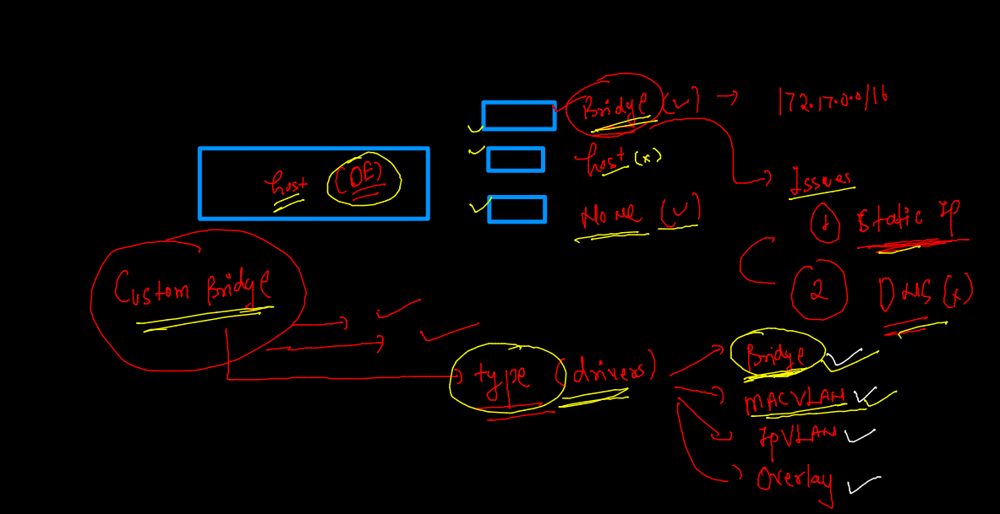
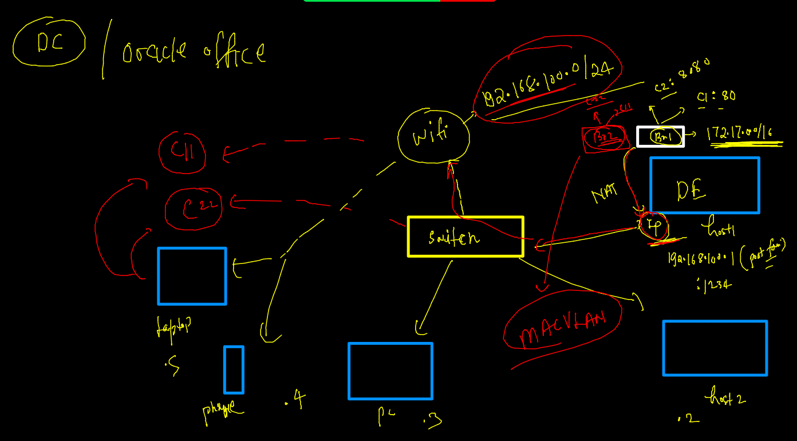
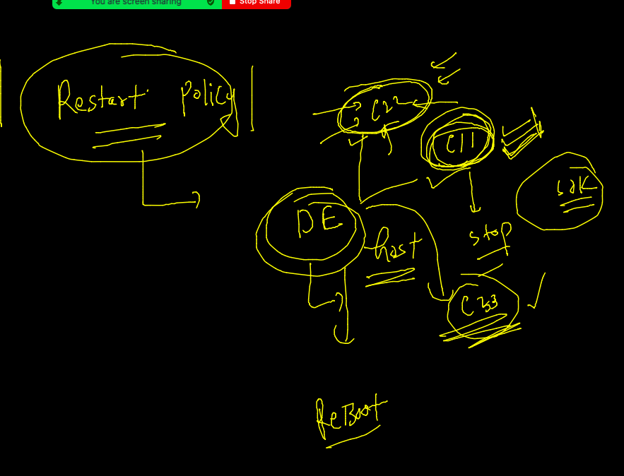
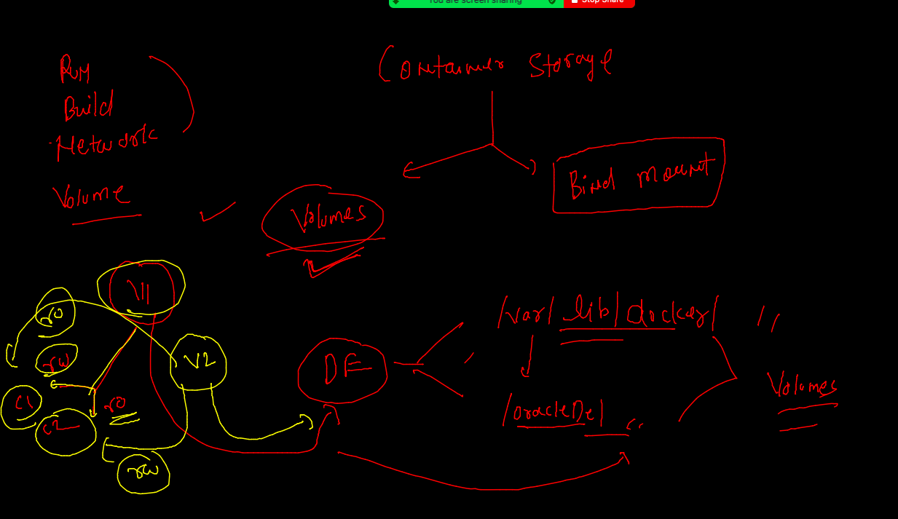

# Docker resume --

### Multi stage Dockerfile --

### java springboot webapp 

### step 1 
```
git clone  https://github.com/redashu/java-springboot.git

```

### routing  / port forwarding --


### create container 

```
docker  run  -itd  --name ashuc1 -p 1234:8080  springboot:ashuv1 
```

## image sharing 


## pushing image to docker hub 

### image name format 


### pushing 

```
docker  images  |   grep -i ashu
springboot                               ashuv1     75b6926692d7   59 minutes ago      680MB
ashupython                               v3         b9295740b2f1   24 hours ago        54MB
ashupython                               v2         ea2032aab842   24 hours ago        418MB
ashupython                               v1         5d4016c34a84   25 hours ago        917MB
[ashu@ip-172-31-95-240 java-springboot]$ 
[ashu@ip-172-31-95-240 java-springboot]$ docker  tag  springboot:ashuv1   docker.io/dockerashu/sprintboot:ashuv1  
[ashu@ip-172-31-95-240 java-springboot]$ 
[ashu@ip-172-31-95-240 java-springboot]$ docker  login  
Login with your Docker ID to push and pull images from Docker Hub. If you don't have a Docker ID, head over to https://hub.docker.com to create one.
Username: dockerashu
Password: 
WARNING! Your password will be stored unencrypted in /home/ashu/.docker/config.json.
Configure a credential helper to remove this warning. See
https://docs.docker.com/engine/reference/commandline/login/#credentials-store

Login Succeeded
[ashu@ip-172-31-95-240 java-springboot]$ docker  push docker.io/dockerashu/sprintboot:ashuv1
The push refers to repository [docker.io/dockerashu/sprintboot]
fb44da6df907: Pushed 
c87267376ab1: Mounted from library/tomcat 
4615e9e05ab0: Mounted from library/tomcat 
1102d6901aad: Mounted from library/tomcat 
fe4f44af763d: Mounted from library/tomcat 

```


### push image to OCR 

```
$ docker  tag   springboot:ashuv1   phx.ocir.io/axmbtg8judkl/javawebapp:v1 
[ashu@ip-172-31-95-240 java-springboot]$ 
[ashu@ip-172-31-95-240 java-springboot]$ 
[ashu@ip-172-31-95-240 java-springboot]$ 
[ashu@ip-172-31-95-240 java-springboot]$ docker  login   phx.ocir.io  
Username: axmbtg8judkl/learntechbyme@gmail.com
Password: 
WARNING! Your password will be stored unencrypted in /home/ashu/.docker/config.json.
Configure a credential helper to remove this warning. See
https://docs.docker.com/engine/reference/commandline/login/#credentials-store

Login Succeeded
[ashu@ip-172-31-95-240 java-springboot]$ docker  push phx.ocir.io/axmbtg8judkl/javawebapp:v1
The push refers to repository [phx.ocir.io/axmbtg8judkl/javawebapp]
fb44da6df907: Pushed 
c87267376ab1: Pushed 
4615e9e05ab0: Pushed 
1102d6901aad: Pushed 
fe4f44af763d: Pushed 
7c072cee6a29: Pushed 
1e5fdc3d671c: Pushed 
613ab28cf833: Pushed 
bed676ceab7a: Pushed 
6398d5cccd2c: Pushed 
0b0f2f2f5279: Pushed 
v1: digest: sha256:fde328e269dab285c3af2d0452e6d3c7e37ef0b5db0656a74a015af1d1054f18 size: 2630
[ashu@ip-172-31-95-240 java-springboot]$ 
[ashu@ip-172-31-95-240 java-springboot]$ docker  logout  phx.ocir.io 

```

### pulling image 

```

fire@ubuntu:~$ docker  pull  phx.ocir.io/axmbtg8judkl/javawebapp:v1 
Error response from daemon: pull access denied for phx.ocir.io/axmbtg8judkl/javawebapp, repository does not exist or may require 'docker login': denied: Anonymous users are only allowed read access on public repos
fire@ubuntu:~$ 
fire@ubuntu:~$ 
fire@ubuntu:~$ docker  login  phx.ocir.io 
Username: axmbtg8judkl/learntechbyme@gmail.com
Password: 
WARNING! Your password will be stored unencrypted in /home/fire/.docker/config.json.
Configure a credential helper to remove this warning. See
https://docs.docker.com/engine/reference/commandline/login/#credentials-store

Login Succeeded
fire@ubuntu:~$ docker  pull  phx.ocir.io/axmbtg8judkl/javawebapp:v1 
v1: Pulling from axmbtg8judkl/javawebapp
0c6b8ff8c37e: Pull complete 
412caad352a3: Pull complete 


```

### Docker advanced bridge drivers 



### remove all containers 

```
docker  rm $(docker  ps -aq)  -f
1365d983516b
ebea905d264e
5b4e9f76dfe5
```

### checking static ip with container 

```
 docker  network  create  ashubr1
dafd19e4f4faece91adefe12c4f5d3aef2490c9778a72c6cfe8d95d9670f0735
[ashu@ip-172-31-95-240 java-springboot]$ docker  network  ls
NETWORK ID     NAME      DRIVER    SCOPE
dafd19e4f4fa   ashubr1   bridge    local
acd6785f29b0   bridge    bridge    local
5da5bf6c922c   host      host      local
09ee78f30ca3   none      null      local
[ashu@ip-172-31-95-240 java-springboot]$ 
[ashu@ip-172-31-95-240 java-springboot]$ 
[ashu@ip-172-31-95-240 java-springboot]$ docker  network  create  ashubr2  --subnet  192.168.10.0/24 
cc7c867763ca1882b6cf84f568d9d7efc1b11b8f27ad639d230e28392d0d00c4
[ashu@ip-172-31-95-240 java-springboot]$ docker  run -itd --name cc11 --network ashubr2 --ip  192.168.10.100  alpine 
Unable to find image 'alpine:latest' locally
latest: Pulling from library/alpine
59bf1c3509f3: Pull complete 
Digest: sha256:21a3deaa0d32a8057914f36584b5288d2e5ecc984380bc0118285c70fa8c9300
Status: Downloaded newer image for alpine:latest
7a850bcf7106bb263532c5c0e90570d65d77c1e78eac8944c7ece355a1327d45
[ashu@ip-172-31-95-240 java-springboot]$ docker  exec -it cc11 ifconfig 
eth0      Link encap:Ethernet  HWaddr 02:42:C0:A8:0A:64  
          inet addr:192.168.10.100  Bcast:192.168.10.255  Mask:255.255.255.0
          UP BROADCAST RUNNING MULTICAST  MTU:1500  Metric:1
          RX packets:10 errors:0 dropped:0 overruns:0 frame:0
          TX packets:0 errors:0 dropped:0 overruns:0 carrier:0
          collisions:0 txqueuelen:0 
          RX bytes:940 (940.0 B)  TX bytes:0 (0.0 B)

lo        Link encap:Local Loopback  
          inet addr:127.0.0.1  Mask:255.0.0.0
          UP LOOPBACK RUNNING  MTU:65536  Metric:1
          RX packets:0 errors:0 dropped:0 overruns:0 frame:0
          TX packets:0 errors:0 dropped:0 overruns:0 carrier:0
          collisions:0 txqueuelen:1000 
          RX bytes:0 (0.0 B)  TX bytes:0 (0.0 B)

[ashu@ip-172-31-95-240 java-springboot]$ docker  restart  cc11
cc11
[ashu@ip-172-31-95-240 java-springboot]$ docker kill cc11
cc11
[ashu@ip-172-31-95-240 java-springboot]$ docker start  cc11
cc11
[ashu@ip-172-31-95-240 java-springboot]$ docker  exec -it cc11 ifconfig 
eth0      Link encap:Ethernet  HWaddr 02:42:C0:A8:0A:64  
          inet addr:192.168.10.100  Bcast:192.168.10.255  Mask:255.255.255.0
          UP BROADCAST RUNNING MULTICAST  MTU:1500  Metric:1
          RX packets:7 errors:0 dropped:0 overruns:0 frame:0
          TX packets:0 errors:0 dropped:0 overruns:0 carrier:0
          collisions:0 txqueuelen:0 
          RX bytes:650 (650.0 B)  TX bytes:0 (0.0 B)

lo        Link encap:Local Loopback  
          inet addr:127.0.0.1  Mask:255.0.0.0
          UP LOOPBACK RUNNING  MTU:65536  Metric:1
          RX packets:0 errors:0 dropped:0 overruns:0 frame:0
          TX packets:0 errors:0 dropped:0 overruns:0 carrier:0
          collisions:0 txqueuelen:1000 
          RX bytes:0 (0.0 B)  TX bytes:0 (0.0 B)


```

### MacVLAN 



### demo 

```
242  docker  network  create  -d  macvlan  --subnet 192.168.1.0/24  --gateway 192.168.1.254 -o parent=ens33   
  243  docker  network  create  ashubr9 -d  macvlan  --subnet 192.168.1.0/24  --gateway 192.168.1.254 -o parent=ens33   
  244  history 
  245  docker  network  ls
  246  docker run -itd --name me  --network ashubr9  --ip  192.168.1.200 alpine 
  247  docker  exec -it  me sh 
  248  docker run -itd --network ashubr9  --ip  192.168.1.201  nginx 
  249  docker ps
  250  docker images
  251  docker run -itd --network ashubr9 --ip 192.168.1.202 phx.ocir.io/axmbtg8judkl/javawebapp:v1
```
### Container restart policy 



### restart policy 
[restart policy](https://docs.docker.com/config/containers/start-containers-automatically/)

### format json 

```
 docker  inspect  cc11  --format='{{.Id}}'
7a850bcf7106bb263532c5c0e90570d65d77c1e78eac8944c7ece355a1327d45
[ashu@ip-172-31-95-240 java-springboot]$ docker  inspect  cc11  --format='{{.State.Status}}'
running
[ashu@ip-172-31-95-240 java-springboot]$ docker  inspect  cc11  --format='{{.HostConfig.RestartPolicy.Name}}'
no

```

### restart policy 

```
docker  run -itd --name cc22 --restart  always  alpine 
82a3e3b47cf20f49b84355aa080d8ecbfe03a1d67d281038b6e51ef7f0410b6d
[ashu@ip-172-31-95-240 java-springboot]$ 
[ashu@ip-172-31-95-240 java-springboot]$ 
[ashu@ip-172-31-95-240 java-springboot]$ docker  inspect  cc22  --format='{{.HostConfig.RestartPolicy.Name}}'
always
[ashu@ip-172-31-95-240 java-springboot]$ 

```

### Container storage 


### storage team will do that --

```
# lsblk 
NAME          MAJ:MIN RM  SIZE RO TYPE MOUNTPOINT
nvme0n1       259:0    0  100G  0 disk 
|-nvme0n1p1   259:1    0  100G  0 part /
`-nvme0n1p128 259:2    0    1M  0 part 
nvme1n1       259:3    0  200G  0 disk 
[root@ip-172-31-95-240 ~]# 
[root@ip-172-31-95-240 ~]# mkfs.xfs   /dev/nvme1n1   
meta-data=/dev/nvme1n1           isize=512    agcount=16, agsize=3276800 blks
         =                       sectsz=512   attr=2, projid32bit=1
         =                       crc=1        finobt=1, sparse=0
data     =                       bsize=4096   blocks=52428800, imaxpct=25
         =                       sunit=1      swidth=1 blks
naming   =version 2              bsize=4096   ascii-ci=0 ftype=1
log      =internal log           bsize=4096   blocks=25600, version=2
         =                       sectsz=512   sunit=1 blks, lazy-count=1
realtime =none                   extsz=4096   blocks=0, rtextents=0
[root@ip-172-31-95-240 ~]# mkdir  /oracleDe 
[root@ip-172-31-95-240 ~]# mount  /dev/nvme1n1   /oracleDe/

```
### configure docker engine storage

```
  56  mkfs.xfs   /dev/nvme1n1   
   57  mkdir  /oracleDe 
   58  mount  /dev/nvme1n1   /oracleDe/
   59  vim /etc/sysconfig/docker
   60  systemctl daemon-reload 
   61  systemctl  restart  docker 
   62  cd /var/lib/docker/
   63  ls
   64  cd
   65  rsync -avp  /var/lib/docker/  /oracleDe/
   66  history 
[root@ip-172-31-95-240 ~]# systemctl restart  docker 

```

### config file 

```
 cat  /etc/sysconfig/docker
# The max number of open files for the daemon itself, and all
# running containers.  The default value of 1048576 mirrors the value
# used by the systemd service unit.
DAEMON_MAXFILES=1048576

# Additional startup options for the Docker daemon, for example:
# OPTIONS="--ip-forward=true --iptables=true"
# By default we limit the number of open files per container
OPTIONS="--default-ulimit nofile=32768:65536 -g /oracleDe/"

```

### container storge 



### creating volume 

```
 docker  volume  create   ashudb-vol 
ashudb-vol
[ashu@ip-172-31-95-240 images]$ docker  volume ls
DRIVER    VOLUME NAME
local     556afc63af6d58c7a9c0a851f303ca433ef7a24aa9821e27455b065dab4f4bfb
local     ashudb-vol
local     binadb_vol

```

### db container and update restart policy 

```
 215  docker  run -itd  --name ashudb -e MYSQL_ROOT_PASSWORD=Oracle098  -v  ashudb-vol:/var/lib/docker:rw     mysql  
  216  history 
[ashu@ip-172-31-95-240 images]$ docker  ps
CONTAINER ID   IMAGE     COMMAND                  CREATED             STATUS             PORTS                 NAMES
5b7dd4e9175a   mysql     "docker-entrypoint.s…"   11 seconds ago      Up 9 seconds       3306/tcp, 33060/tcp   ashudb
82a3e3b47cf2   alpine    "/bin/sh"                About an hour ago   Up About an hour                         cc22
[ashu@ip-172-31-95-240 images]$ 
[ashu@ip-172-31-95-240 images]$ 
[ashu@ip-172-31-95-240 images]$ docker  update   ashudb  --restart  always 
ashudb
[ashu@ip-172-31-95-240 images]$ 

```

### access db 

```
$ docker  exec -it  ashudb bash 
root@d9a44297a603:/# 
root@d9a44297a603:/# mysql -u root -p
Enter password: 
Welcome to the MySQL monitor.  Commands end with ; or \g.
Your MySQL connection id is 8
Server version: 8.0.28 MySQL Community Server - GPL

Copyright (c) 2000, 2022, Oracle and/or its affiliates.

Oracle is a registered trademark of Oracle Corporation and/or its
affiliates. Other names may be trademarks of their respective
owners.

Type 'help;' or '\h' for help. Type '\c' to clear the current input statement.

mysql> show databases;
+--------------------+
| Database           |
+--------------------+

```

### backend of docker volume 

```
cd  /oracleDe/
[root@ip-172-31-95-240 oracleDe]# ls
buildkit  containers  image  network  overlay2  plugins  runtimes  swarm  tmp  trust  volumes
[root@ip-172-31-95-240 oracleDe]# cd  volumes/
[root@ip-172-31-95-240 volumes]# ls
3322762f339e892f49fb2113cf89ad565b590430ad3a535ade02f0166b3ec3af
556afc63af6d58c7a9c0a851f303ca433ef7a24aa9821e27455b065dab4f4bfb
ashudb-vol
backingFsBlockDev
binadb_vol
dineshdb-vol
dkeshava-vol
e8101a5bf9e64437fbf518c95793e4946221b75655ba3e85c0385f070fb2a689
f682074b941d414d9cca4f990c70c83adacf93f2d2988f631c1cff1ccb1effde
manish_vol
metadata.db
mohit-vol
portainer_data
[root@ip-172-31-95-240 volumes]# cd  ashudb-vol/
[root@ip-172-31-95-240 ashudb-vol]# ls
_data
[root@ip-172-31-95-240 ashudb-vol]# cd _data/
[root@ip-172-31-95-240 _data]# ls
#ib_16384_0.dblwr  binlog.000001  ca.pem            ib_buffer_pool  ibtmp1     performance_schema  server-key.pem
#ib_16384_1.dblwr  binlog.000002  client-cert.pem   ib_logfile0     mysql      private_key.pem     sys
#innodb_temp       binlog.index   client-key.pem    ib_logfile1     mysql.ibd  public_key.pem      undo_001
auto.cnf           ca-key.pem     d9a44297a603.err  ibdata1         oracle

```

### nfs based volume --

```
docker  volume  create ashunfs-vol  --driver local  --opt  type=nfs --opt  o=addr=172.31.3.108,rw --opt    device=:/data/ashu 


====
docker  volume  inspect  ashunfs-vol 
[
    {
        "CreatedAt": "2022-02-22T09:01:01Z",
        "Driver": "local",
        "Labels": {},
        "Mountpoint": "/oracleDe/volumes/ashunfs-vol/_data",
        "Name": "ashunfs-vol",
        "Options": {
            "device": ":/data/ashu",
            "o": "addr=172.31.3.108,rw",
            "type": "nfs"
        },
        "Scope": "local"
    }
]

```

## remove volume 

```
 docker  run -tid  --name  ashuc11  -v  ashunfs-vol:/mnt/data:rw  alpine  
9a062508893548d4d46437d833f57c16aea481f3f9622c6772bc50e20666211b
[ashu@ip-172-31-95-240 images]$ 
[ashu@ip-172-31-95-240 images]$ 
[ashu@ip-172-31-95-240 images]$ 
[ashu@ip-172-31-95-240 images]$ docker  exec  -it  ashuc11 sh 
/ # cd  /mnt/
/mnt # ls
data
/mnt # cd data/
/mnt/data # ls
/mnt/data # mkdir  hello world  this is remote data 
/mnt/data # ls
data    hello   is      remote  this    world
/mnt/data # exit
[ashu@ip-172-31-95-240 images]$ docker  exec  -it  ashuc11 sh 
/ # ls /mnt/data/
data    hello   hiii    is      remote  this    world
/ # exit

```

