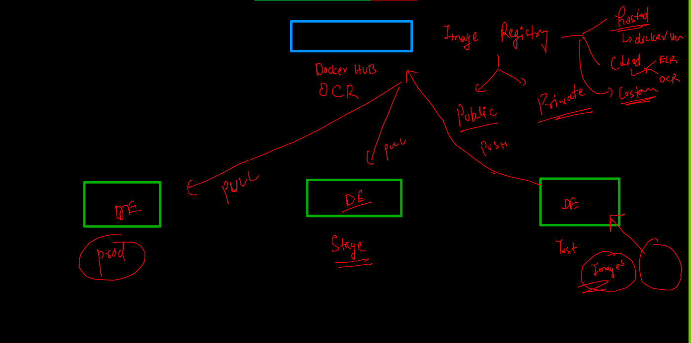
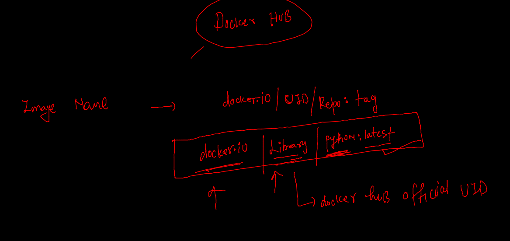

# Docker resume --

### Multi stage Dockerfile --

### java springboot webapp 

### step 1 
```
git clone  https://github.com/redashu/java-springboot.git

```

### routing  / port forwarding --


### create container 

```
docker  run  -itd  --name ashuc1 -p 1234:8080  springboot:ashuv1 
```

## image sharing 



## pushing image to docker hub 

### image name format 


### pushing 

```
docker  images  |   grep -i ashu
springboot                               ashuv1     75b6926692d7   59 minutes ago      680MB
ashupython                               v3         b9295740b2f1   24 hours ago        54MB
ashupython                               v2         ea2032aab842   24 hours ago        418MB
ashupython                               v1         5d4016c34a84   25 hours ago        917MB
[ashu@ip-172-31-95-240 java-springboot]$ 
[ashu@ip-172-31-95-240 java-springboot]$ docker  tag  springboot:ashuv1   docker.io/dockerashu/sprintboot:ashuv1  
[ashu@ip-172-31-95-240 java-springboot]$ 
[ashu@ip-172-31-95-240 java-springboot]$ docker  login  
Login with your Docker ID to push and pull images from Docker Hub. If you don't have a Docker ID, head over to https://hub.docker.com to create one.
Username: dockerashu
Password: 
WARNING! Your password will be stored unencrypted in /home/ashu/.docker/config.json.
Configure a credential helper to remove this warning. See
https://docs.docker.com/engine/reference/commandline/login/#credentials-store

Login Succeeded
[ashu@ip-172-31-95-240 java-springboot]$ docker  push docker.io/dockerashu/sprintboot:ashuv1
The push refers to repository [docker.io/dockerashu/sprintboot]
fb44da6df907: Pushed 
c87267376ab1: Mounted from library/tomcat 
4615e9e05ab0: Mounted from library/tomcat 
1102d6901aad: Mounted from library/tomcat 
fe4f44af763d: Mounted from library/tomcat 

```


### push image to OCR 

```
$ docker  tag   springboot:ashuv1   phx.ocir.io/axmbtg8judkl/javawebapp:v1 
[ashu@ip-172-31-95-240 java-springboot]$ 
[ashu@ip-172-31-95-240 java-springboot]$ 
[ashu@ip-172-31-95-240 java-springboot]$ 
[ashu@ip-172-31-95-240 java-springboot]$ docker  login   phx.ocir.io  
Username: axmbtg8judkl/learntechbyme@gmail.com
Password: 
WARNING! Your password will be stored unencrypted in /home/ashu/.docker/config.json.
Configure a credential helper to remove this warning. See
https://docs.docker.com/engine/reference/commandline/login/#credentials-store

Login Succeeded
[ashu@ip-172-31-95-240 java-springboot]$ docker  push phx.ocir.io/axmbtg8judkl/javawebapp:v1
The push refers to repository [phx.ocir.io/axmbtg8judkl/javawebapp]
fb44da6df907: Pushed 
c87267376ab1: Pushed 
4615e9e05ab0: Pushed 
1102d6901aad: Pushed 
fe4f44af763d: Pushed 
7c072cee6a29: Pushed 
1e5fdc3d671c: Pushed 
613ab28cf833: Pushed 
bed676ceab7a: Pushed 
6398d5cccd2c: Pushed 
0b0f2f2f5279: Pushed 
v1: digest: sha256:fde328e269dab285c3af2d0452e6d3c7e37ef0b5db0656a74a015af1d1054f18 size: 2630
[ashu@ip-172-31-95-240 java-springboot]$ 
[ashu@ip-172-31-95-240 java-springboot]$ docker  logout  phx.ocir.io 

```

### pulling image 

```

fire@ubuntu:~$ docker  pull  phx.ocir.io/axmbtg8judkl/javawebapp:v1 
Error response from daemon: pull access denied for phx.ocir.io/axmbtg8judkl/javawebapp, repository does not exist or may require 'docker login': denied: Anonymous users are only allowed read access on public repos
fire@ubuntu:~$ 
fire@ubuntu:~$ 
fire@ubuntu:~$ docker  login  phx.ocir.io 
Username: axmbtg8judkl/learntechbyme@gmail.com
Password: 
WARNING! Your password will be stored unencrypted in /home/fire/.docker/config.json.
Configure a credential helper to remove this warning. See
https://docs.docker.com/engine/reference/commandline/login/#credentials-store

Login Succeeded
fire@ubuntu:~$ docker  pull  phx.ocir.io/axmbtg8judkl/javawebapp:v1 
v1: Pulling from axmbtg8judkl/javawebapp
0c6b8ff8c37e: Pull complete 
412caad352a3: Pull complete 


```
