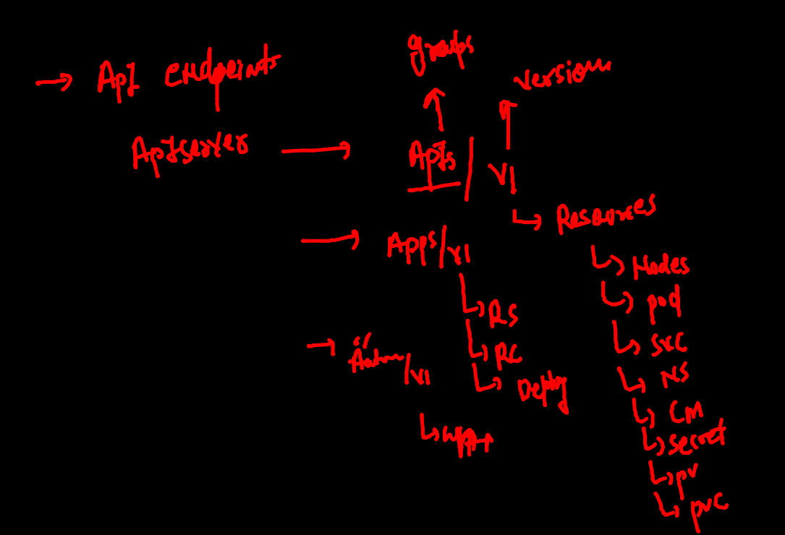
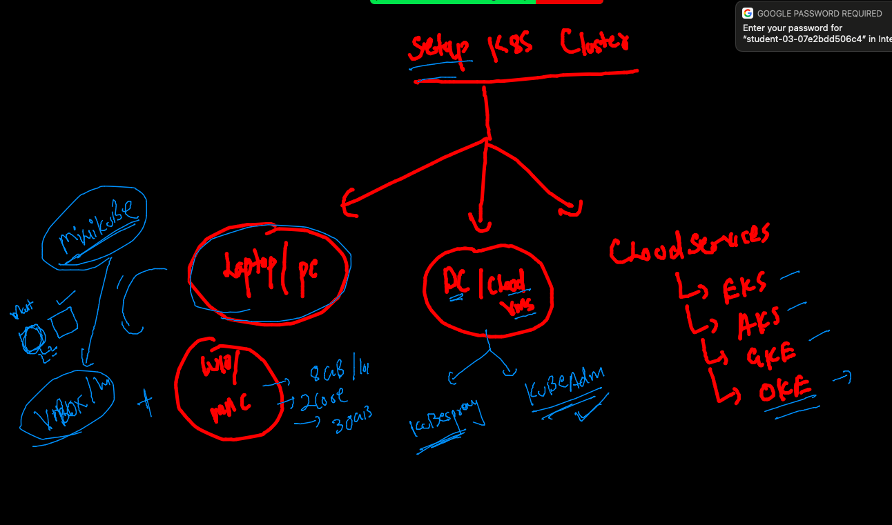
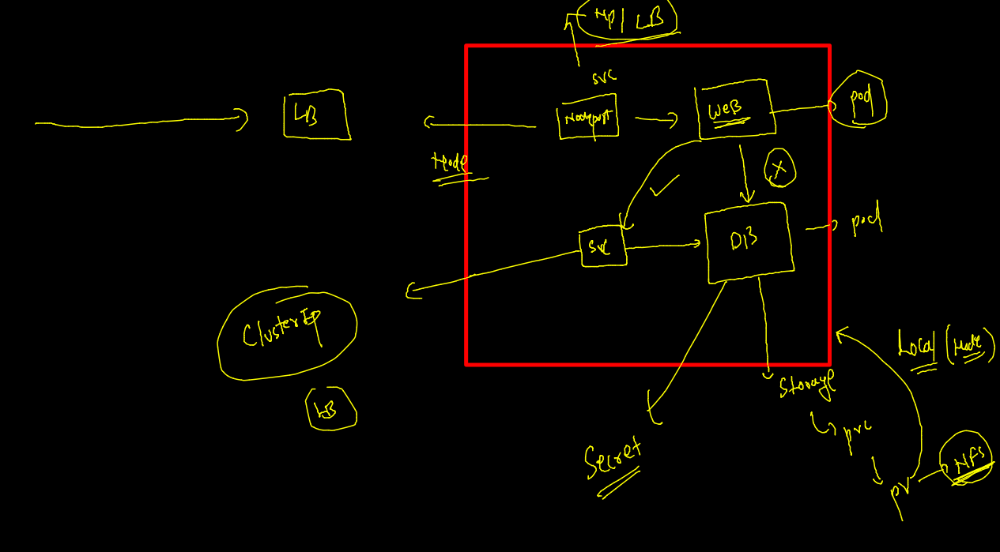
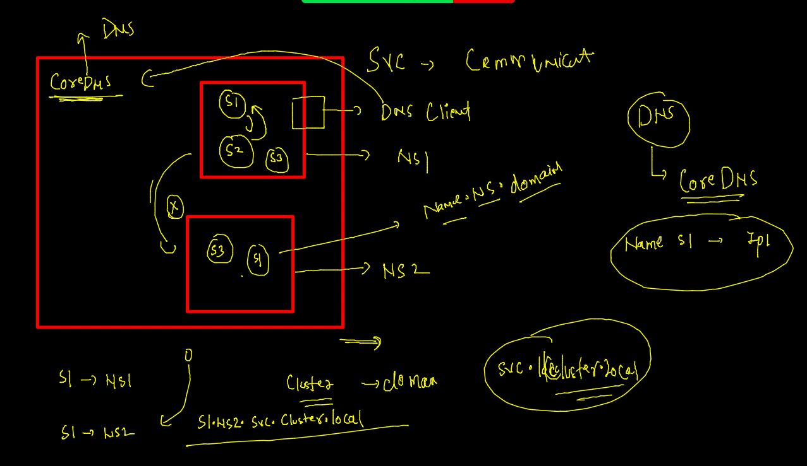
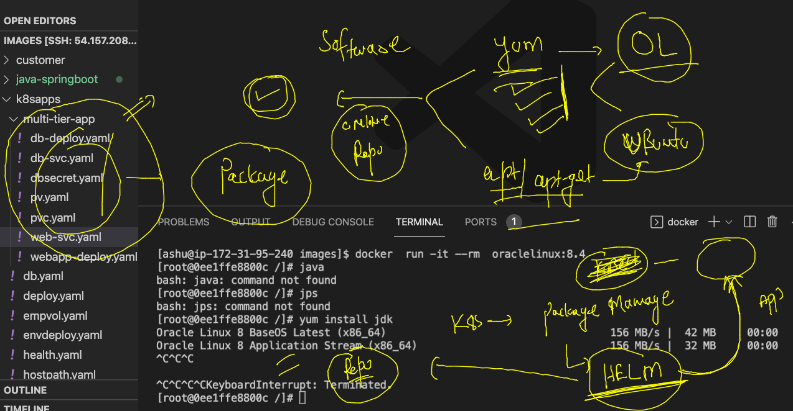

# KUbernetes big picture 



## to query kube apiserver from k8s client 

### step1 start proxy 

```
kubectl  proxy 

```

### step 2 use curl / postman tools to query api 

```
558  curl http://127.0.0.1:8001
  559  curl http://127.0.0.1:8001/apis/apps/v1
  560  curl http://127.0.0.1:8001/api/v1

```

### k8s cluster setup --



### multi tier app in k8s 



### cleaning up namespace --

```

[ashu@ip-172-31-95-240 images]$ kubectl delete all --all
pod "ashudb-7d87944bfb-rwvxj" deleted
deployment.apps "ashudb" deleted
replicaset.apps "ashudb-7d87944bfb" deleted
[ashu@ip-172-31-95-240 images]$ kubectl  get  cm 
NAME               DATA   AGE
ashuenv            1      24h
kube-root-ca.crt   1      45h
[ashu@ip-172-31-95-240 images]$ kubectl delete cm  ashuenv
configmap "ashuenv" deleted
[ashu@ip-172-31-95-240 images]$ kubectl get secret 
NAME                  TYPE                                  DATA   AGE
ashudbpass            Opaque                                1      17h
ashusec               kubernetes.io/dockerconfigjson        1      45h
default-token-mbhrj   kubernetes.io/service-account-token   3      45h
[ashu@ip-172-31-95-240 images]$ kubectl delete secret  ashudbpass ashusec 
secret "ashudbpass" deleted
secret "ashusec" deleted

```

### Deployment of multi-tier app --

### step 1 to deploy pv using hostPAth

```
kubectl apply -f  multi-tier-app/
persistentvolume/ashu-pv created
[ashu@ip-172-31-95-240 k8sapps]$ kubectl get  pv
NAME      CAPACITY   ACCESS MODES   RECLAIM POLICY   STATUS      CLAIM   STORAGECLASS   REASON   AGE
ashu-pv   2Gi        RWO            Retain           Available  

```

### create pvc 

```
[ashu@ip-172-31-95-240 k8sapps]$ kubectl get  pvc 
NAME         STATUS   VOLUME     CAPACITY   ACCESS MODES   STORAGECLASS   AGE
ashu-claim   Bound    mohit-pv   1Gi        RWO                           4m34s

```

### create secret 

```
 kubectl apply -f  multi-tier-app/
secret/ashudbsec created
persistentvolume/ashu-pv unchanged
persistentvolumeclaim/ashu-claim unchanged
[ashu@ip-172-31-95-240 k8sapps]$ kubectl  get secret
NAME                  TYPE                                  DATA   AGE
ashudbsec             Opaque                                1      11s
default-token-mbhrj   kubernetes.io/service-account-token   3      45h
```

### create deploy for DB --

```
kubectl apply -f . 
deployment.apps/ashudb created
secret/ashudbsec configured
persistentvolume/ashu-pv unchanged
persistentvolumeclaim/ashu-claim unchanged
```
### creating service for DB --

```
 kubectl get deploy 
NAME     READY   UP-TO-DATE   AVAILABLE   AGE
ashudb   1/1     1            1           26m
fire@ashutoshhs-MacBook-Air ~ % kubectl expose deploy  ashudb  --type ClusterIP  --port 3306  --dry-run=client -o yaml 
apiVersion: v1
kind: Service
metadata:
  creationTimestamp: null
  labels:
    app: ashudb
  name: ashudb
spec:
  ports:
  - port: 3306
    protocol: TCP
    targetPort: 3306
  selector:
    app: ashudb
  type: ClusterIP
status:
  loadBalancer: {}

```


### service name based communication -- with CoreDNS concept 

```
fire@ashutoshhs-MacBook-Air ~ % kubectl exec -it testpod1 -- sh       
/ # nslookup ashudb 
Server:		10.96.0.10
Address:	10.96.0.10:53

Name:	ashudb.ashu-project.svc.cluster.local
Address: 10.104.109.68

```

### CoreDNS understanding 



### Create webapp which is having html / css /js as FRONTend -- and PHP as backend 

```
 kubectl create  deployment ashu-webapp  --image=wordpress:4.8-apache --port 80 --dry-run=client  -o yaml 
apiVersion: apps/v1
kind: Deployment
metadata:
  creationTimestamp: null
  labels:
    app: ashu-webapp
  name: ashu-webapp
spec:
  replicas: 1
  selector:
    matchLabels:
      app: ashu-webapp
  strategy: {}
  template:
    metadata:

```

### deploy after changes 

```
 kubectl get deploy 
NAME          READY   UP-TO-DATE   AVAILABLE   AGE
ashu-webapp   1/1     1            1           23s
ashudb        1/1     1            1           52m
fire@ashutoshhs-MacBook-Air ~ % kubectl get  po    
NAME                           READY   STATUS    RESTARTS   AGE
ashu-webapp-57b544d6d7-xdzhm   1/1     Running   0          31s
ashudb-67ccd95494-h7l9g        1/1     Running   0          53m
testpod1                       1/1     Running   0          17m

```

### creating service for webapp of NodePort type 

```
 kubectl  get deploy 
NAME          READY   UP-TO-DATE   AVAILABLE   AGE
ashu-webapp   1/1     1            1           13m
ashudb        1/1     1            1           65m
fire@ashutoshhs-MacBook-Air ~ % kubectl expose deploy  ashu-webapp  --type NodePort --port 80 --name websvc --dry-run=client  -o yaml 
apiVersion: v1
kind: Service
metadata:
  creationTimestamp: null
  labels:
    app: ashu-webapp
  name: websvc
spec:
  ports:
  - port: 80
    protocol: TCP
    targetPort: 80
  selector:
    app: ashu-webapp
  type: NodePort
status:
  loadBalancer: {}

```

### minikube cluster 

```
 docker images
REPOSITORY                    TAG       IMAGE ID       CREATED        SIZE
gcr.io/k8s-minikube/kicbase   v0.0.29   64d09634c60d   2 months ago   1.14GB
fire@ubuntu:~$ minikube  version 
minikube version: v1.25.1
commit: 3e64b11ed75e56e4898ea85f96b2e4af0301f43d
fire@ubuntu:~$ minikube  start  --driver=docker
😄  minikube v1.25.1 on Ubuntu 20.04
✨  Using the docker driver based on existing profile
👍  Starting control plane node minikube in cluster minikube
🚜  Pulling base image ...
🏃  Updating the running docker "minikube" container ...
🐳  Preparing Kubernetes v1.23.1 on Docker 20.10.12 ...
    ▪ kubelet.housekeeping-interval=5m
🔎  Verifying Kubernetes components...
    ▪ Using image gcr.io/k8s-minikube/storage-provisioner:v5
🌟  Enabled addons: storage-provisioner, default-storageclass
🏄  Done! kubectl is now configured to use "minikube" cluster and "default" namespace by default
fire@ubuntu:~$ 
fire@ubuntu:~$ kubectl   get  nodes
NAME       STATUS   ROLES                  AGE    VERSION
minikube   Ready    control-plane,master   3h5m   v1.23.1
fire@ubuntu:~$ kubectl   get  ns
NAME              STATUS   AGE

```
### adding node 

```
minikube node add

😄  Adding node m02 to cluster minikube

❗  Cluster was created without any CNI, adding a node to it might cause broken networking.

👍  Starting worker node minikube-m02 in cluster minikube

🚜  Pulling base image ...

🔥  Creating docker container (CPUs=2, Memory=2200MB) ...

🐳  Preparing Kubernetes v1.23.1 on Docker 20.10.12 ...

🔎  Verifying Kubernetes components...

🏄  Successfully added m02 to minikube!

fire@ubuntu:~$ kubectl  get nodes

NAME           STATUS   ROLES                  AGE    VERSION

minikube       Ready    control-plane,master   3h7m   v1.23.1

minikube-m02   Ready    <none>                 13s    v1.23.1

fire@ubuntu:~$ minikube ip 

192.168.49.2

fire@ubuntu:~$ minikube node delete

❌  Exiting due to MK_USAGE: Usage: minikube node delete [name]

fire@ubuntu:~$ minikube node delete  minikube-m02

🔥  Deleting node minikube-m02 from cluster minikube

✋  Stopping node "minikube-m02"  ...

🛑  Powering off "minikube-m02" via SSH ...

🔥  Deleting "minikube-m02" in docker ...

�

```

### Intro to Helm 



### Installing helm in linux client 

### Download 

```
wget https://get.helm.sh/helm-v3.8.0-linux-amd64.tar.gz
```

### untar it 

```
tar xvzf helm-v3.8.0-linux-amd64.tar.gz
```

### copy in path variable 

```
cp helm-v3.8.0-linux-amd64/helm /usr/bin/
chmod +x /usr/bin/helm 
```

### checking helm installation 

```
 helm version 
version.BuildInfo{Version:"v3.8.0", GitCommit:"d14138609b01886f544b2025f5000351c9eb092e", GitTreeState:"clean", GoVersion:"go1.17.5"}
```

### adding repo list in current helm client machine 

```
 
[ashu@ip-172-31-95-240 images]$ helm repo add kubernetes-dashboard https://kubernetes.github.io/dashboard/
"kubernetes-dashboard" has been added to your repositories
[ashu@ip-172-31-95-240 images]$ 
[ashu@ip-172-31-95-240 images]$ 
[ashu@ip-172-31-95-240 images]$ helm repo listNAME                    URL                                    
bitnami                 https://charts.bitnami.com/bitnami     
kubernetes-dashboard    https://kubernetes.github.io/dashboard/
[ashu@ip-172-31-95-240 images]$ 


```

### searching for helm charts 

```
 helm  search  repo nginx 
NAME                                    CHART VERSION   APP VERSION     DESCRIPTION                                       
bitnami/nginx                           9.8.0           1.21.6          NGINX Open Source is a web server that can be a...
bitnami/nginx-ingress-controller        9.1.7           1.1.1           NGINX Ingress Controller is an Ingress controll...
bitnami/nginx-intel                     0.1.4           0.4.7           NGINX Open Source for Intel is a lightweight se...
bitnami/kong                            5.0.2         
```


### download online charts to view structure 

```
helm  search  repo  mysql 
NAME                    CHART VERSION   APP VERSION     DESCRIPTION                                       
bitnami/mysql           8.8.25          8.0.28          MySQL is a fast, reliable, scalable, and easy t...
bitnami/phpmyadmin      9.0.6           5.1.3           phpMyAdmin is a free software tool written in P...
bitnami/mariadb         10.3.6          10.5.15         MariaDB is an open source, community-developed ...
bitnami/mariadb-cluster 1.0.2           10.2.14         DEPRECATED Chart to create a Highly available M...
bitnami/mariadb-galera  7.0.4           10.6.7          MariaDB Galera is a multi-master database clust...
[ashu@ip-172-31-95-240 images]$ mkdir  helm-charts
[ashu@ip-172-31-95-240 images]$ cd  helm-charts/
[ashu@ip-172-31-95-240 helm-charts]$ 
[ashu@ip-172-31-95-240 helm-charts]$ 
[ashu@ip-172-31-95-240 helm-charts]$ helm pull bitnami/mysql
[ashu@ip-172-31-95-240 helm-charts]$ ls
mysql-8.8.25.tgz
[ashu@ip-172-31-95-240 helm-charts]$ tar  xvzf mysql-8.8.25.tgz 
mysql/Chart.yaml
mysql/Chart.lock
mysql/values.yaml
mysql/values.schema.json
mysql/templates/NOTES.txt
mysql/templates/_helpers.tpl

```

### deploy k8s dashboard --

```
2  helm repo list
  653  helm install my-dashboard  kubernetes-dashboard/kubernetes-dashboard
  654  helm ls
  655  kubectl get  deploy 
  656  kubectl get  po 
  657  kubectl get  svc
  658  kubectl get  secret
  659  history 
  660  helm ls
  661  helm delete my-dashboard
  662  history 
[ashu@ip-172-31-95-240 helm-charts]$ helm ls
WARNING: Kubernetes configuration file is group-readable. This is insecure. Location: /home/ashu/.kube/config
WARNING: Kubernetes configuration file is world-readable. This is insecure. Location: /home/ashu/.kube/config
NAME    NAMESPACE       REVISION        UPDATED STATUS  CHART   APP VERSION
[ashu@ip-172-31-95-240 helm-charts]$ 
[ashu@ip-172-31-95-240 helm-charts]$ kubectl  get  po 
No resources found in test-dashb namespace.
```

