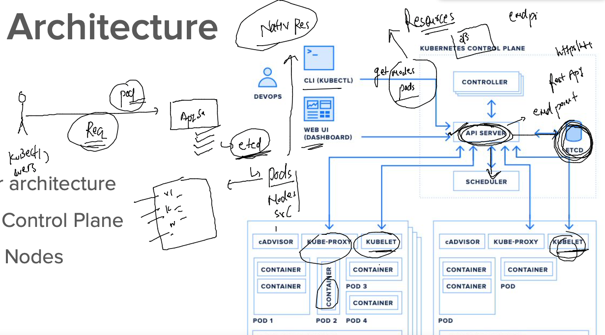
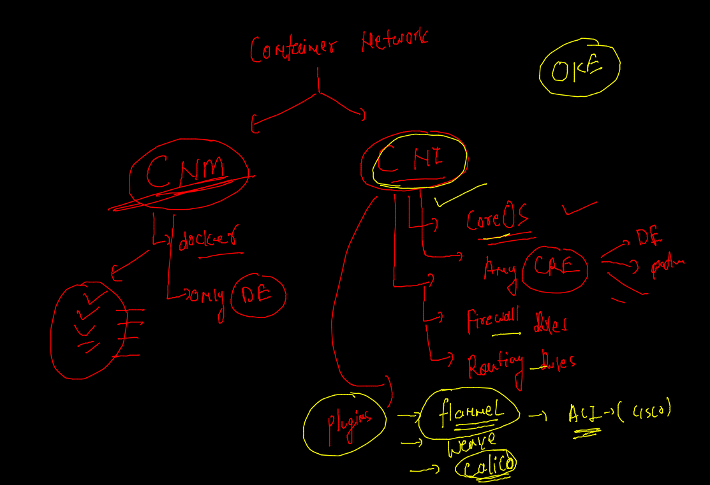
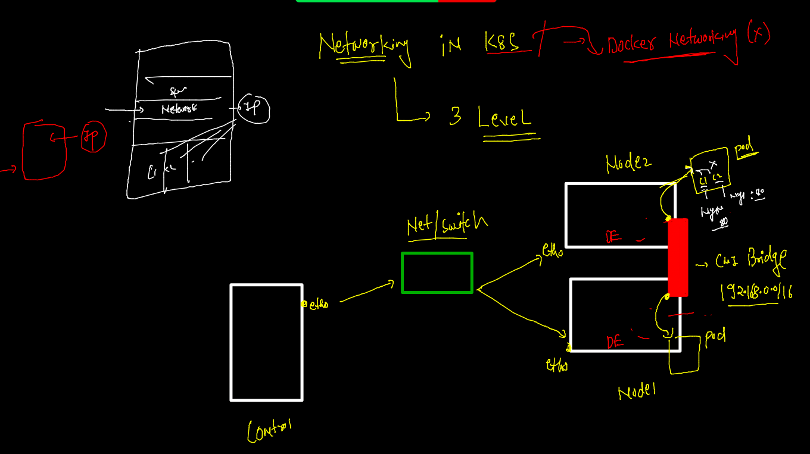
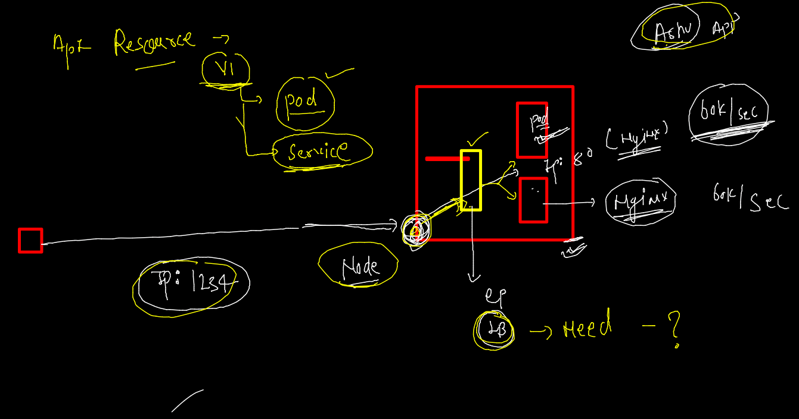
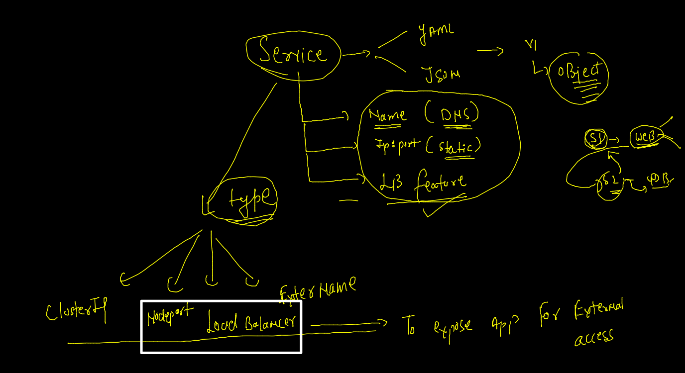
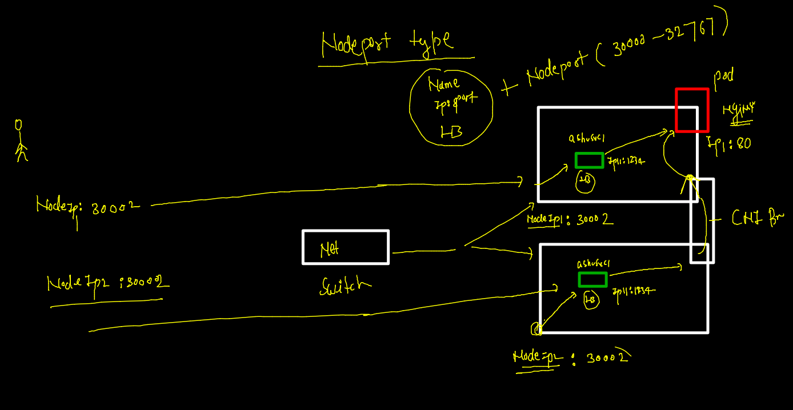

# k8s revision --



### api resources listing through curl 


## auto generate YAML / JSON 

```
kubectl  run  ashuwebapp --image=docker.io/dockerashu/oracleweb:appv1  --port=80  --dry-run=client  -o yaml 
kubectl  run  ashuwebapp --image=docker.io/dockerashu/oracleweb:appv1  --port=80  --dry-run=client  -o json 
```

### Deploy pod yaml 

```
 kubectl apply -f web.yaml 
pod/ashuwebapp created
[ashu@ip-172-31-95-240 k8sapps]$ kubectl get  po
NAME          READY   STATUS    RESTARTS   AGE
ashuwebapp    1/1     Running   0          5s
mohitwebapp   1/1     Running   0          39s
[ashu@ip-172-31-95-240 k8sapps]$ kubectl get  po -o wide
NAME          READY   STATUS    RESTARTS   AGE   IP               NODE                            NOMINATED NODE   READINESS GATES
ashuwebapp    1/1     Running   0          16s   192.168.60.194   ip-172-31-89-245.ec2.internal   <none>           <none>
mohitwebapp   1/1     Running   0          50s   192.168.60.193   ip-172-31-89-245.ec2.internal   <none>           <none>
  

```

### additional info about pod 

```
 kubectl  describe  pod  ashuwebapp 
Name:         ashuwebapp
Namespace:    default
Priority:     0
Node:         ip-172-31-89-245.ec2.internal/172.31.89.245
Start Time:   Wed, 23 Feb 2022 04:58:45 +0000
Labels:       run=ashuwebapp
Annotations:  cni.projectcalico.org/containerID: 22d0f49ad7b61fba8b1a17e076bad1f60bf474e2451cee138cd26c96dfd4f8a2
              cni.projectcalico.org/podIP: 192.168.60.194/32
              cni.projectcalico.org/podIPs: 192.168.60.194/32
Status:       Running
IP:           192.168.60.194
IPs:
  IP:  192.168.60.194
```

## Container networking 



### CNI bridge



###  Intro to Internal LB 



### Service intro 



## Nodeport service 



### checking labels of the pods

```
kubectl apply -f  web.yaml 
pod/ashuwebapp configured
[ashu@ip-172-31-95-240 k8sapps]$ kubectl get  po    --show-labels
NAME           READY   STATUS    RESTARTS   AGE   LABELS
ashuwebapp     1/1     Running   0          75m   x=helloashuapp
binawebapp     1/1     Running   0          74m   run=binawebapp

```

### creating service of nodeport type 

```
 kubectl create  service 
Create a service using a specified subcommand.

Aliases:
service, svc

Available Commands:
  clusterip    Create a ClusterIP service
  externalname Create an ExternalName service
  loadbalancer Create a LoadBalancer service
  nodeport     Create a NodePort service

```

### 

```
 kubectl create  service nodeport  ashusvc1  --tcp 1234:80  --dry-run=client  -o yaml 
apiVersion: v1
kind: Service
metadata:
  creationTimestamp: null
  labels:
    app: ashusvc1
  name: ashusvc1
spec:
  ports:
  - name: 1234-80
    port: 1234
    protocol: TCP
    targetPort: 80
  selector:
    app: ashusvc1
  type: NodePort
status:
  loadBalancer: {}


```

### deploy svc 

```
 ls
pod1.yaml  websvc.yaml  web.yaml
[ashu@ip-172-31-95-240 k8sapps]$ kubectl apply -f  websvc.yaml 
service/ashusvc1 created
[ashu@ip-172-31-95-240 k8sapps]$ kubectl get service 
NAME         TYPE        CLUSTER-IP       EXTERNAL-IP   PORT(S)          AGE
ashusvc1     NodePort    10.109.135.160   <none>        1234:31058/TCP   7s
kubernetes   ClusterIP   10.96.0.1        <none>        443/TCP          20h
[ashu@ip-172-31-95-240 k8sapps]$ kubectl get svc
NAME         TYPE        CLUSTER-IP       EXTERNAL-IP   PORT(S)          AGE
ashusvc1     NodePort    10.109.135.160   <none>        1234:31058/TCP   18s
deeptisvc1   NodePort    10.106.17.178    <none>        1234:31712/TCP   10s
kubernetes   ClusterIP   10.96.0.1        <none>        443/TCP          20h

```

### svc deployed

```
 kubectl  describe  svc  ashusvc1 
Name:                     ashusvc1
Namespace:                default
Labels:                   app=ashusvc1
Annotations:              <none>
Selector:                 x=helloashuapp
Type:                     NodePort
IP Family Policy:         SingleStack
IP Families:              IPv4
IP:                       10.109.135.160
IPs:                      10.109.135.160
Port:                     1234-80  1234/TCP
TargetPort:               80/TCP
NodePort:                 1234-80  31058/TCP
Endpoints:                192.168.60.194:80
Session Affinity:         None
External Traffic Policy:  Cluster
Events:                   <none>

```

