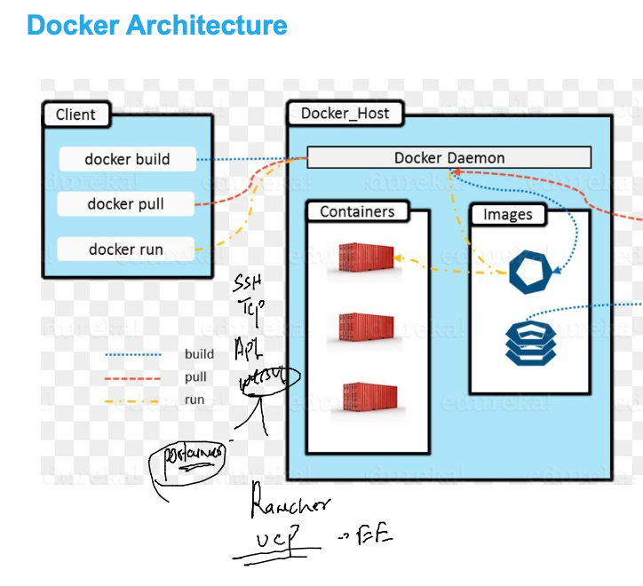
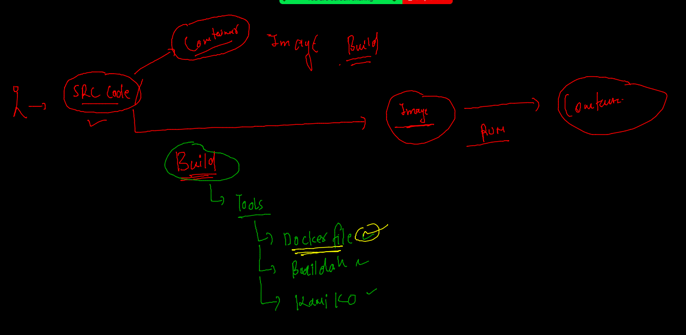
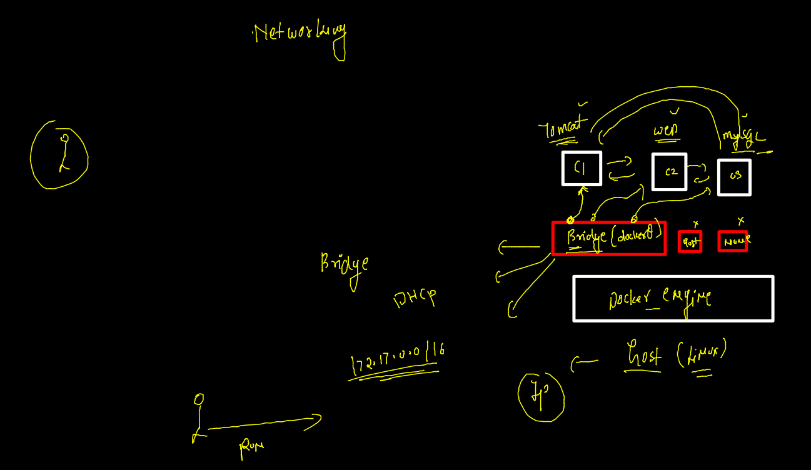

# advk8s_okefeb21_2022

## Docker client and server arch 

### login from docker client machine 



### Some docker basic commands 

```
 docker  pull  oraclelinux:8.4  
8.4: Pulling from library/oraclelinux
a4df6f21af84: Pull complete 
Digest: sha256:b81d5b0638bb67030b207d28586d0e714a811cc612396dbe3410db406998b3ad
Status: Downloaded newer image for oraclelinux:8.4
docker.io/library/oraclelinux:8.4
[ashu@ip-172-31-95-240 ~]$ docker  pull   alpine 
Using default tag: latest
latest: Pulling from library/alpine
59bf1c3509f3: Already exists 
Digest: sha256:21a3deaa0d32a8057914f36584b5288d2e5ecc984380bc0118285c70fa8c9300
Status: Downloaded newer image for alpine:latest
docker.io/library/alpine:latest
[ashu@ip-172-31-95-240 ~]$ docker  images
REPOSITORY                               TAG       IMAGE ID       CREATED         SIZE
registry                                 2         9c97225e83c8   13 days ago     24.2MB
alpine                                   latest    c059bfaa849c   2 months ago    5.59MB
cr.portainer.io/portainer/portainer-ce   2.9.3     ad0ecf974589   3 months ago    252MB
oraclelinux                              8.4       97e22ab49eea   3 months ago    246MB
gcr.io/cadvisor/cadvisor                 latest    68c29634fe49   14 months ago   163MB
```

### accessing container shell 

```
docker  exec  -it   ashuc1  sh 
/ # whoami
root
/ # ls /
bin    dev    etc    home   lib    media  mnt    opt    proc   root   run    sbin   srv    sys    tmp    usr    var
/ # exit

```

### Image building using docker file 



### building image 

```
cd  pythonapp/
[ashu@ip-172-31-95-240 pythonapp]$ ls
Dockerfile  oracle.py
[ashu@ip-172-31-95-240 pythonapp]$ docker  build  -t  ashupython:v1  . 
Sending build context to Docker daemon  3.584kB
Step 1/6 : FROM python
latest: Pulling from library/python
0c6b8ff8c37e: Pull complete 
412caad352a3: Pull complete 
e6d3e61f7a50: Pull complete 
461bb1d8c517: Pull complete 
808edda3c2e8: Pull complete 
724cfd2dc19b: Pull complete 
1bb6570cd7ac: Pull complete 
aca06d6d45b1: Pull complete 
678714351737: Pull complete 
Digest: sha256:f06f47e4bfbda3ba69c4e1ea304f5a3c2a48ee6399ab28c82369fc59eb89410e
Status: Downloaded newer image for python:latest
 ---> dfce7257b7ba
Step 2/6 : LABEL name=ashutoshh
 ---> Running in 305e66e2b872
Removing intermediate container 305e66e2b872
 ---> 997f80c9f243
Step 3/6 : LABEL email=ashutoshh@linux.com
 ---> Running in e0eceeed2152
Removing intermediate container e0eceeed2152
 ---> d1edae3bca5f
Step 4/6 : RUN mkdir /mycode
 ---> Running in 947585643f6b
Removing intermediate container 947585643f6b
 ---> 119b2911942e
Step 5/6 : COPY  oracle.py /mycode/
 ---> eac7d1938acb
Step 6/6 : CMD  ["python","/mycode/oracle.py"]
 ---> Running in 52d4f260cf87
Removing intermediate container 52d4f260cf87
 ---> 5d4016c34a84
Successfully built 5d4016c34a84
Successfully tagged ashupython:v1

```

### checkig images

```
docker  images
REPOSITORY                               TAG       IMAGE ID       CREATED              SIZE
mohitpython                              v1        5e8d139f0e8c   59 seconds ago       917MB
binapython                               v1        c5c47cbcc664   About a minute ago   917MB
swatipython                              v1        d31db012b6b0   About a minute ago   917MB
ashupython                               v1        5d4016c34a84   About a minute ago   917MB
manishpy                                 v1        c91d4f9af271   About a minute ago   917MB
python                                   latest    dfce7257b7ba   13 days ago          917MB

```

### creating container 

```
ocker  run -itd  --name  ashuc2  ashupython:v1 
063df8a7a74500180e5ea150d03d5d208d86a384dd5266f75c99e13ab25ee5e3
[ashu@ip-172-31-95-240 pythonapp]$ 
[ashu@ip-172-31-95-240 pythonapp]$ docker  ps
CONTAINER ID   IMAGE                                          COMMAND                  CREATED         STATUS                 PORTS                                                                                            NAMES
2983f58d5028   binapython:v1                                  "python /mycode/orac…"   3 seconds ago   Up 2 seconds                                                                                                            bina2
063df8a7a745   ashupython:v1                                  "python /mycode/orac…"   5 seconds ago   Up 4 seconds                                     
```


### checking logs and stats

```
39  docker  logs  ashuc2
   40  docker  logs  -f  ashuc2
   41  history 
   42  docker  stats

```

### building docker image 

```
 ls
ashuapp.dockerfile  Dockerfile  oracle.py
[ashu@ip-172-31-95-240 pythonapp]$ docker  build  -t  ashupython:v2  -f  ashuapp.dockerfile  . 
Sending build context to Docker daemon   5.12kB
Step 1/7 : FROM oraclelinux:8.4
 ---> 97e22ab49eea
Step 2/7 : LABEL name=ashutoshh
 ---> Running in d89758546754
Removing intermediate container d89758546754
 ---> d27e03bd17e9
Step 3/7 : LABEL email=ashutoshh@linux.com
 ---> Running in dd9d2b03b35e
Removing intermediate container dd9d2b03b35e
 ---> c9fb8149b5f3
Step 4/7 : RUN  yum  install python3 -y

```

## Docker container networking --



### checking list of docker network 

```
docker network  ls
NETWORK ID     NAME      DRIVER    SCOPE
acd6785f29b0   bridge    bridge    local
5da5bf6c922c   host      host      local
09ee78f30ca3   none      null      local

```

### inspecting network 

```
docker network  inspect  bridge  
[
    {
        "Name": "bridge",
        "Id": "acd6785f29b0c7bfe3cf03687a11f73af0905766b58a6e4ce4f6b450d099a29c",
        "Created": "2022-02-21T02:17:11.209644424Z",
        "Scope": "local",
        "Driver": "bridge",
        "EnableIPv6": false,
        "IPAM": {
            "Driver": "default",
            "Options": null,
            "Config": [
                {
                    "Subnet": "172.17.0.0/16"
                }

```

### accessing container and ping to another one 

```
 docker  exec -it  ashutest1  sh 
/ # 
/ # ifconfig 
eth0      Link encap:Ethernet  HWaddr 02:42:AC:11:00:04  
          inet addr:172.17.0.4  Bcast:172.17.255.255  Mask:255.255.0.0
          UP BROADCAST RUNNING MULTICAST  MTU:1500  Metric:1
          RX packets:9 errors:0 dropped:0 overruns:0 frame:0
          TX packets:0 errors:0 dropped:0 overruns:0 carrier:0
          collisions:0 txqueuelen:0 
          RX bytes:710 (710.0 B)  TX bytes:0 (0.0 B)

lo        Link encap:Local Loopback  
          inet addr:127.0.0.1  Mask:255.0.0.0
          UP LOOPBACK RUNNING  MTU:65536  Metric:1
          RX packets:0 errors:0 dropped:0 overruns:0 frame:0
          TX packets:0 errors:0 dropped:0 overruns:0 carrier:0
          collisions:0 txqueuelen:1000 
          RX bytes:0 (0.0 B)  TX bytes:0 (0.0 B)

/ # ping  172.17.0.5 
PING 172.17.0.5 (172.17.0.5): 56 data bytes
64 bytes from 172.17.0.5: seq=0 ttl=64 time=0.180 ms
64 bytes from 172.17.0.5: seq=1 ttl=64 time=0.097 ms
64 bytes from 172.17.0.5: seq=2 ttl=64 time=0.389 ms
64 bytes from 172.17.0.5: seq=3 ttl=64 time=0.073 ms
^C
--- 172.17.0.5 ping statistics ---
4 packets transmitted, 4 packets received, 0% packet loss
round-trip min/avg/max = 0.073/0.184/0.389 ms
/ # exit

```

### Conatiner in No network zone 

```
docker  run -itd  --name ashutest2  --network none   alpine  
26f827d7bde370fefcd4cb87f80b95af79bcf1faf213f504ec73ef72c81056f1
[ashu@ip-172-31-95-240 pythonapp]$ docker  exec -it  ashutest2  sh 
/ # ping  172.17.0.4
PING 172.17.0.4 (172.17.0.4): 56 data bytes
ping: sendto: Network unreachable
/ # 
/ # ping www.google.com 
ping: bad address 'www.google.com'
/ # 
[ashu@ip-172-31-95-240 pythonapp]$ 

```

### creating -- custom bridge 

```

[ashu@ip-172-31-95-240 pythonapp]$ docker  network  create  ashubr1
fa615451ba98ad5cb2818bcf00ce4b6a95dd810226f7db4c1dcbedf43708293d
[ashu@ip-172-31-95-240 pythonapp]$ docker  network  ls
NETWORK ID     NAME      DRIVER    SCOPE
fa615451ba98   ashubr1   bridge    local
acd6785f29b0   bridge    bridge    local
5da5bf6c922c   host      host      local
09ee78f30ca3   none      null      local
[ashu@ip-172-31-95-240 pythonapp]$ docker  network  inspect  ashubr1  
[
    {
        "Name": "ashubr1",
        "Id": "fa615451ba98ad5cb2818bcf00ce4b6a95dd810226f7db4c1dcbedf43708293d",
        "Created": "2022-02-21T06:52:29.2319107Z",
        "Scope": "local",
        "Driver": "bridge",
        "EnableIPv6": false,
        "IPAM": {
            "Driver": "default",
            "Options": {},
            "Config": [
                {
                    "Subnet": "172.19.0.0/16",
                    "Gateway": "172.19.0.1"
                }
            ]
```

### two diff bridge containers can't access to each-other

```
 docker  run -itd --name ashutest3  --network ashubr1  alpine 
da3912e80a25d41c7d481a3bc1eba86cec26ba1998d8f3c42e47e46acae05701
[ashu@ip-172-31-95-240 pythonapp]$ 
[ashu@ip-172-31-95-240 pythonapp]$ 
[ashu@ip-172-31-95-240 pythonapp]$ docker  exec -it  ashutest3  sh 
/ # ifconfig 
eth0      Link encap:Ethernet  HWaddr 02:42:AC:13:00:02  
          inet addr:172.19.0.2  Bcast:172.19.255.255  Mask:255.255.0.0
          UP BROADCAST RUNNING MULTICAST  MTU:1500  Metric:1
          RX packets:11 errors:0 dropped:0 overruns:0 frame:0
          TX packets:0 errors:0 dropped:0 overruns:0 carrier:0
          collisions:0 txqueuelen:0 
          RX bytes:1010 (1010.0 B)  TX bytes:0 (0.0 B)

lo        Link encap:Local Loopback  
          inet addr:127.0.0.1  Mask:255.0.0.0
          UP LOOPBACK RUNNING  MTU:65536  Metric:1
          RX packets:0 errors:0 dropped:0 overruns:0 frame:0
          TX packets:0 errors:0 dropped:0 overruns:0 carrier:0
          collisions:0 txqueuelen:1000 
          RX bytes:0 (0.0 B)  TX bytes:0 (0.0 B)

/ # ping  172.17.0.4
PING 172.17.0.4 (172.17.0.4): 56 data bytes
^C
--- 172.17.0.4 ping statistics ---
3 packets transmitted, 0 packets received, 100% packet loss
/ # ping  www.google.com 
PING www.google.com (172.253.122.99): 56 data bytes
64 bytes from 172.253.122.99: seq=0 ttl=50 time=1.666 ms
64 bytes from 172.253.122.99: seq=1 ttl=50 time=1.750 ms
64 bytes from 172.253.122.99: seq=2 ttl=50 time=1.499 ms
^C
--- www.google.com ping statistics ---
3 packets transmitted, 3 packets received, 0% packet loss
round-trip min/avg/max = 1.499/1.638/1.750 ms
/ # exit

```

### same bridge container can access to each other using name also 

```
 docker  run -itd --name ashutest4  --network ashubr1  alpine 
e25115f129d8a85cc9dc901513a9f7e0692bb5b023f10a67befeb03e974441f8
[ashu@ip-172-31-95-240 pythonapp]$ 
[ashu@ip-172-31-95-240 pythonapp]$ 
[ashu@ip-172-31-95-240 pythonapp]$ docker  exec -it  ashutest3  sh 
/ # ping ashutest4
PING ashutest4 (172.19.0.3): 56 data bytes
64 bytes from 172.19.0.3: seq=0 ttl=64 time=0.103 ms
64 bytes from 172.19.0.3: seq=1 ttl=64 time=0.102 ms
^C
--- ashutest4 ping statistics ---
2 packets transmitted, 2 packets received, 0% packet loss
round-trip min/avg/max = 0.102/0.102/0.103 ms
/ # exit

```


