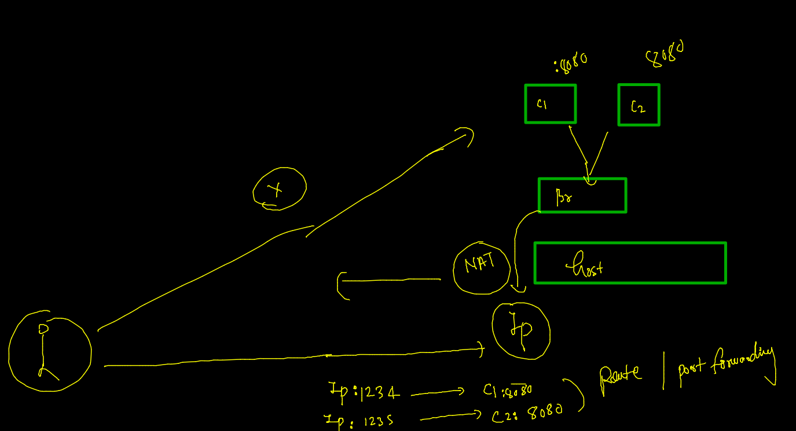

# Docker resume --

### Multi stage Dockerfile --

### java springboot webapp 

### step 1 
```
git clone  https://github.com/redashu/java-springboot.git

```

### routing  / port forwarding --



### create container 

```
docker  run  -itd  --name ashuc1 -p 1234:8080  springboot:ashuv1 
```

