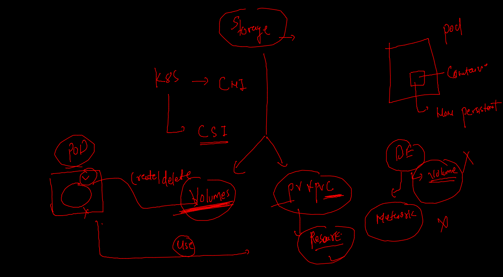

# k8s Master node component

## controllers 


### api resources understanding 


### COnfigMAP 


### env 

```
% kubectl create configmap  ashuenv  --from-literal   key1=app1                  configmap/ashuenv created
fire@ashutoshhs-MacBook-Air ~ % kubectl get  cm 
NAME               DATA   AGE
ashuenv            1      43s
kube-root-ca.crt   1      21h

```

### deploy app 

```
kubectl apply -f  envdeploy.yaml 
deployment.apps/ashuapp created
[ashu@ip-172-31-95-240 k8sapps]$ kubectl get deploy 
NAME      READY   UP-TO-DATE   AVAILABLE   AGE
ashuapp   1/1     1            1           7s
[ashu@ip-172-31-95-240 k8sapps]$ kubectl get cm
NAME               DATA   AGE
ashuenv            1      4m7s
kube-root-ca.crt   1      21h
[ashu@ip-172-31-95-240 k8sapps]$ kubectl get  po
NAME                       READY   STATUS    RESTARTS   AGE
ashuapp-6758d9d668-j9pxb   1/1     Running   0          18s

```

### varify env 

```
kubectl exec -it  ashuapp-6758d9d668-j9pxb  -- env  
PATH=/usr/local/sbin:/usr/local/bin:/usr/sbin:/usr/bin:/sbin:/bin
HOSTNAME=ashuapp-6758d9d668-j9pxb
TERM=xterm
deploy=app1

```

### creating nodeport service using expose 

```
kubectl  get deploy 
NAME      READY   UP-TO-DATE   AVAILABLE   AGE
ashuapp   1/1     1            1           6m9s
fire@ashutoshhs-MacBook-Air ~ % kubectl expose deploy  ashuapp  --type NodePort --port 1122 --target-port 80      --name ashusvc111 
service/ashusvc111 exposed
fire@ashutoshhs-MacBook-Air ~ % kubectl  get  svc 
NAME         TYPE       CLUSTER-IP     EXTERNAL-IP   PORT(S)          AGE
ashusvc111   NodePort   10.98.22.205   <none>        1122:30497/TCP   6s

```

### NP and LB svc 

```
 kubectl expose deploy ashuapp  --type LoadBalancer  --port 1234 --target-port 80  --name lbsvc 
service/lbsvc exposed
fire@ashutoshhs-MacBook-Air ~ % kubectl get  svc
NAME         TYPE           CLUSTER-IP      EXTERNAL-IP   PORT(S)          AGE
ashusvc111   NodePort       10.98.22.205    <none>        1122:30497/TCP   20m
lbsvc        LoadBalancer   10.103.200.48   <pending>     1234:31090/TCP   3s
```

### LB in OKE 

```
kubectl create deployment dd1  --image=dockerashu/oracleapp:24thfeb2022 --port 80 --dry-run=client -o yaml >oke.yaml 
learntechb@cloudshell:~ (us-phoenix-1)$ kubectl create cm ashuenv --from-literal key1=app1 
configmap/ashuenv created
learntechb@cloudshell:~ (us-phoenix-1)$ vim oke.yaml 
learntechb@cloudshell:~ (us-phoenix-1)$ kubectl apply -f  oke.yaml 
deployment.apps/dd1 created
learntechb@cloudshell:~ (us-phoenix-1)$ kubectl get deploy 
NAME   READY   UP-TO-DATE   AVAILABLE   AGE
dd1    0/1     1            0           11s
learntechb@cloudshell:~ (us-phoenix-1)$ kubectl get po -w
NAME                   READY   STATUS    RESTARTS   AGE
dd1-7fd57f4dd9-dsccd   1/1     Running   0          17s
^Clearntechb@cloudshell:~ (us-phoenix-1)$ kubectl get deploy 
NAME   READY   UP-TO-DATE   AVAILABLE   AGE
dd1    1/1     1            1           25s
learntechb@cloudshell:~ (us-phoenix-1)$ kubectl get cm 
NAME               DATA   AGE
ashuenv            1      2m4s
kube-root-ca.crt   1      27m
learntechb@cloudshell:~ (us-phoenix-1)$ kubectl expose deploy dd1 --type LoadBalancer --port 80 --name  mysvc1 
service/mysvc1 exposed
learntechb@cloudshell:~ (us-phoenix-1)$ kubectl get svc
NAME         TYPE           CLUSTER-IP      EXTERNAL-IP   PORT(S)        AGE
kubernetes   ClusterIP      10.96.0.1       <none>        443/TCP        28m
mysvc1       LoadBalancer   10.96.101.184   <pending>     80:32709/TCP   10s
learntechb@cloudshell:~ (us-phoenix-1)$ kubectl get svc
NAME         TYPE           CLUSTER-IP      EXTERNAL-IP     PORT(S)        AGE
kubernetes   ClusterIP      10.96.0.1       <none>          443/TCP        29m
mysvc1       LoadBalancer   10.96.101.184   129.153.88.25   80:32709/TCP   61s
learntechb@cloudshell:~ (us-phoenix-1)$ 

```

### dashboard deployment 

```
 kubectl apply -f https://raw.githubusercontent.com/kubernetes/dashboard/v2.5.0/aio/deploy/recommended.yaml
namespace/kubernetes-dashboard created
serviceaccount/kubernetes-dashboard created
service/kubernetes-dashboard created
secret/kubernetes-dashboard-certs created
secret/kubernetes-dashboard-csrf created

```

### URL of dashboard --

[k8s_dashboard](https://kubernetes.io/docs/tasks/access-application-cluster/web-ui-dashboard/)

### to access dashboard we change service type to NodePort or LB depends on cluster type 

```
 kubectl  -n  kubernetes-dashboard   get  deploy 
NAME                        READY   UP-TO-DATE   AVAILABLE   AGE
dashboard-metrics-scraper   1/1     1            1           67s
kubernetes-dashboard        1/1     1            1           69s
fire@ashutoshhs-MacBook-Air ~ % kubectl  -n  kubernetes-dashboard   get  po     
NAME                                         READY   STATUS    RESTARTS   AGE
dashboard-metrics-scraper-799d786dbf-82f9k   1/1     Running   0          73s
kubernetes-dashboard-546cbc58cd-d2qqf        1/1     Running   0          75s
fire@ashutoshhs-MacBook-Air ~ % kubectl  -n  kubernetes-dashboard   get  svc
NAME                        TYPE        CLUSTER-IP      EXTERNAL-IP   PORT(S)    AGE
dashboard-metrics-scraper   ClusterIP   10.101.42.107   <none>        8000/TCP   81s
kubernetes-dashboard        ClusterIP   10.110.12.43    <none>        443/TCP    90s
fire@ashutoshhs-MacBook-Air ~ % kubectl  -n  kubernetes-dashboard   edit   svc kubernetes-dashboard
service/kubernetes-dashboard edited
fire@ashutoshhs-MacBook-Air ~ % kubectl  -n  kubernetes-dashboard   get  svc                       
NAME                        TYPE        CLUSTER-IP      EXTERNAL-IP   PORT(S)         AGE
dashboard-metrics-scraper   ClusterIP   10.101.42.107   <none>        8000/TCP        2m2s
kubernetes-dashboard        NodePort    10.110.12.43    <none>        443:32461/TCP   2m11s

```

### get token for dashboard 

```
kubectl  -n  kubernetes-dashboard   get  secret 
NAME                               TYPE                                  DATA   AGE
default-token-4nvc8                kubernetes.io/service-account-token   3      5m11s
kubernetes-dashboard-certs         Opaque                                0      5m8s
kubernetes-dashboard-csrf          Opaque                                1      5m7s
kubernetes-dashboard-key-holder    Opaque                                2      5m6s
kubernetes-dashboard-token-svm5k   kubernetes.io/service-account-token   3      5m10s
fire@ashutoshhs-MacBook-Air ~ % 
fire@ashutoshhs-MacBook-Air ~ % 
fire@ashutoshhs-MacBook-Air ~ % kubectl  -n  kubernetes-dashboard  describe   secret  kubernetes-dashboard-token-svm5k 
Name:         kubernetes-dashboard-token-svm5k
Namespace:    kubernetes-dashboard
Labels:       <none>
Annotations:  kubernetes.io/service-account.name: kubernetes-dashboard
              kubernetes.io/service-account.uid: e17ccd4d-23a6-4db7-bd05-ac2c729787ac

```

### giving full access to dashboard 

```
kubectl  create  clusterrolebinding  dashboardaccess  --clusterrole=cluster-admin --serviceaccount=kubernetes-dashboard:kubernetes-dashboard 
clusterrolebinding.rbac.authorization.k8s.io/dashboardaccess created

```

### Liveness Probe Demo 

```
kubectl create  deployment testcase1 --image=dockerashu/liveness:appv1    --port 80  --dry-run=client  -o yaml >health.yaml

```

## Storage in k8s 



### k8s volumes --


### EmptyDir volume to take storage from minion node -- at some random location 

```
kubectl exec -it ashudep4-78fc65b85f-ggv8q  -- sh 
/ # cd  /mnt/
/mnt # ls
oracle
/mnt # cd  oracle/
/mnt/oracle # ls
time.txt
/mnt/oracle # ls -l time.txt 
-rw-r--r--    1 root     root           174 Feb 24 09:24 time.txt
/mnt/oracle # cat  time.txt 
Thu Feb 24 09:22:53 UTC 2022
Thu Feb 24 09:23:08 UTC 2022
Thu Feb 24 09:23:23 UTC 2022
Thu Feb 24 09:23:38 UTC 2022
Thu Feb 24 09:23:53 UTC 2022
Thu Feb 24 09:24:08 UTC 2022
/mnt/oracle # cat  time.txt 
Thu Feb 24 09:22:53 UTC 2022
Thu Feb 24 09:23:08 UTC 2022
Thu Feb 24 09:23:23 UTC 2022
Thu Feb 24 09:23:38 UTC 2022
Thu Feb 24 09:23:53 UTC 2022
Thu Feb 24 09:24:08 UTC 2022
Thu Feb 24 09:24:23 UTC 2022
Thu Feb 24 09:24:38 UTC 2022
/mnt/oracle # exit


```

### Multi container Pod Design


### sidecar container pattern 


### access containers in multi container pod 

```
 kubectl get  po    
NAME                       READY   STATUS    RESTARTS   AGE
ashudep4-bbc6b9984-lwsp5   2/2     Running   0          37s
fire@ashutoshhs-MacBook-Air ~ % kubectl  exec  -it  ashudep4-bbc6b9984-lwsp5  -- bash 
Defaulted container "sidecar" out of: sidecar, datagenerator
root@ashudep4-bbc6b9984-lwsp5:/# 
root@ashudep4-bbc6b9984-lwsp5:/# cd /usr/share/nginx/html/
root@ashudep4-bbc6b9984-lwsp5:/usr/share/nginx/html# ls
time.txt
root@ashudep4-bbc6b9984-lwsp5:/usr/share/nginx/html# 
exit
fire@ashutoshhs-MacBook-Air ~ % kubectl  exec  -it  ashudep4-bbc6b9984-lwsp5  -- bash 
Defaulted container "sidecar" out of: sidecar, datagenerator
root@ashudep4-bbc6b9984-lwsp5:/# cd /usr/share/nginx/html/
root@ashudep4-bbc6b9984-lwsp5:/usr/share/nginx/html# ls
time.txt
root@ashudep4-bbc6b9984-lwsp5:/usr/share/nginx/html# rm time.txt 
rm: cannot remove 'time.txt': Read-only file system
root@ashudep4-bbc6b9984-lwsp5:/usr/share/nginx/html# exit
exit
command terminated with exit code 1
fire@ashutoshhs-MacBook-Air ~ % kubectl  exec  -it  ashudep4-bbc6b9984-lwsp5 -c datagenerator -- sh   
/ # cd  /mnt/oracle/
/mnt/oracle # ls
time.txt
/mnt/oracle # exit


```

### creating service -

```
% 
fire@ashutoshhs-MacBook-Air ~ % kubectl get deploy 
NAME       READY   UP-TO-DATE   AVAILABLE   AGE
ashudep4   1/1     1            1           2m51s
fire@ashutoshhs-MacBook-Air ~ % kubectl expose deploy ashudep4 --type NodePort --port 80 --name x1
service/x1 exposed
fire@ashutoshhs-MacBook-Air ~ % kubectl get svc
NAME   TYPE       CLUSTER-IP       EXTERNAL-IP   PORT(S)        AGE
x1     NodePort   10.110.250.111   <none>        80:31458/TCP   5s
fire@ashutoshhs-MacBook-Air ~ % 

```

### PV and PVC 


### deploy--

```
 kubectl get deploy 
NAME     READY   UP-TO-DATE   AVAILABLE   AGE
ashudb   1/1     1            1           10s
fire@ashutoshhs-MacBook-Air ~ % kubectl get  secret
NAME                  TYPE                                  DATA   AGE
ashudbpass            Opaque                                1      4m9s
ashusec               kubernetes.io/dockerconfigjson        1      27h
default-token-mbhrj   kubernetes.io/service-account-token   3      27h
fire@ashutoshhs-MacBook-Air ~ % kubectl get  pvc   
NAME         STATUS   VOLUME     CAPACITY   ACCESS MODES   STORAGECLASS   AGE
ashu-claim   Bound    mohit-pv   1Gi        RWO                           20m
fire@ashutoshhs-MacBook-Air ~ % kubectl get  po 
NAME                      READY   STATUS    RESTARTS   AGE
ashudb-7d87944bfb-rwvxj   1/1     Running   0          25s
fire@ashutoshhs-MacBook-Air ~ % kubectl logs -f  ashudb-7d87944bfb-rwvxj
2022-02-24 11:32:10+00:00 [Note] [Entrypoint]: Entrypoint script for MySQL Server 8.0.28-1debian10 started.
2022-02-24 11:32:10+00:00 [Note] [Entrypoint]: Switching to dedicated u

```


