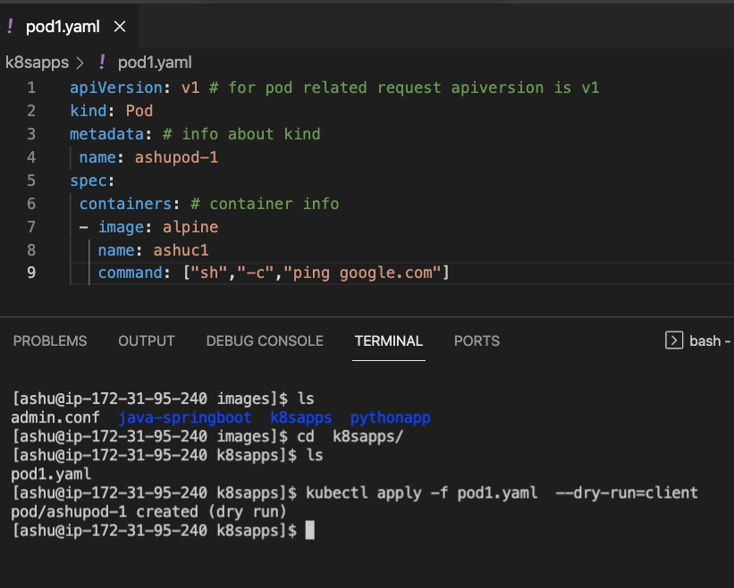

# kubernetes Intro --


### k8s arch 

### hardware and networking level 


### master node component which api-server 


### kubectl to interact 

```
kubectl cluster-info  --kubeconfig  admin.conf 
Kubernetes control plane is running at https://172.31.91.6:6443
CoreDNS is running at https://172.31.91.6:6443/api/v1/namespaces/kube-system/services/kube-dns:dns/proxy
```

### 

```
kubectl cluster-info  --kubeconfig  admin.conf 
Kubernetes control plane is running at https://172.31.91.6:6443
CoreDNS is running at https://172.31.91.6:6443/api/v1/namespaces/kube-system/services/kube-dns:dns/proxy

To further debug and diagnose cluster problems, use 'kubectl cluster-info dump'.
[ashu@ip-172-31-95-240 images]$ kubectl get  nodes  --kubeconfig  admin.conf 
NAME            STATUS   ROLES                  AGE   VERSION
control-plane   Ready    control-plane,master   53m   v1.23.4
node1           Ready    <none>                 53m   v1.23.4
```

### copy kubeconfig file with right client side location 

```

[ashu@ip-172-31-95-240 images]$ mkdir  ~/.kube
mkdir: cannot create directory ‘/home/ashu/.kube’: File exists
[ashu@ip-172-31-95-240 images]$ 
[ashu@ip-172-31-95-240 images]$ cp -v admin.conf  ~/.kube/config 
‘admin.conf’ -> ‘/home/ashu/.kube/config’
[ashu@ip-172-31-95-240 images]$ 
[ashu@ip-172-31-95-240 images]$ 
[ashu@ip-172-31-95-240 images]$ kubectl get  nodes 
NAME            STATUS   ROLES                  AGE   VERSION
control-plane   Ready    control-plane,master   55m   v1.23.4
node1           Ready    <none>                 55m   v1.23.4
[ashu@ip-172-31-95-240 images]$ 

```

### ETCD -- 


## container images will be deployed as POD --- in k8s 


### POD YAML and dry-run 



### Deploy yaml 

```

[ashu@ip-172-31-95-240 k8sapps]$ kubectl apply -f pod1.yaml  --dry-run=client 
pod/ashupod-1 created (dry run)
[ashu@ip-172-31-95-240 k8sapps]$ kubectl apply -f pod1.yaml 
pod/ashupod-1 created
[ashu@ip-172-31-95-240 k8sapps]$ kubectl get  pods 
NAME        READY   STATUS    RESTARTS   AGE
ashupod-1   1/1     Running   0          16s
[ashu@ip-172-31-95-240 k8sapps]$ kubectl get  pods 
NAME          READY   STATUS    RESTARTS   AGE
ashupod-1     1/1     Running   0          31s
binapod-1     1/1     Running   0          15s
manishpod-1   1/1     Running   0          4s

```

### pod info 

```
 kubectl get  no
NAME            STATUS   ROLES                  AGE    VERSION
control-plane   Ready    control-plane,master   116m   v1.23.4
node1           Ready    <none>                 115m   v1.23.4
[ashu@ip-172-31-95-240 k8sapps]$ kubectl get po -o wide
NAME          READY   STATUS    RESTARTS   AGE     IP                NODE    NOMINATED NODE   READINESS GATES
ashupod-1     1/1     Running   0          5m8s    192.168.166.132   node1   <none>           <none>
binapod-1     1/1     Running   0          4m52s   192.168.166.133   node1   <none>           <none>
deeptipod-1   1/1     Running   0          2m22s   192.168.166.135   node1   <none>           <none>
dineshpod-1   1/1     Running   0          68s     192.168.166.136   node1   <none>           <none>
manishpod-1   1/1     Running   0          4m41s   192.168.166.134   node1   <none>           <none>
mohitpod-1    1/1     Running   0          36s     192.168.166.137   node1   <none>           <none>
[ashu@ip-172-31-95-240 k8sapps]$ 
```
### more pod operations 

```
283  kubectl  logs -f  ashupod-1
  284  history 
[ashu@ip-172-31-95-240 k8sapps]$ 
[ashu@ip-172-31-95-240 k8sapps]$ 
[ashu@ip-172-31-95-240 k8sapps]$ kubectl  exec -it  ashupod-1  -- sh 
/ # 
/ # cat /etc/os-release 
NAME="Alpine Linux"
ID=alpine
VERSION_ID=3.15.0
PRETTY_NAME="Alpine Linux v3.15"
HOME_URL="https://alpinelinux.org/"
BUG_REPORT_URL="https://bugs.alpinelinux.org/"
/ # eit
sh: eit: not found
/ # exit
command terminated with exit code 127
```

### delete pod 

```
 kubectl delete pod  ashupod-1
pod "ashupod-1" deleted
[ashu@ip-172-31-95-240 k8sapps]$ kubectl get  po 
NAME          READY   STATUS    RESTARTS   AGE
binapod-1     1/1     Running   0          8m39s
```


