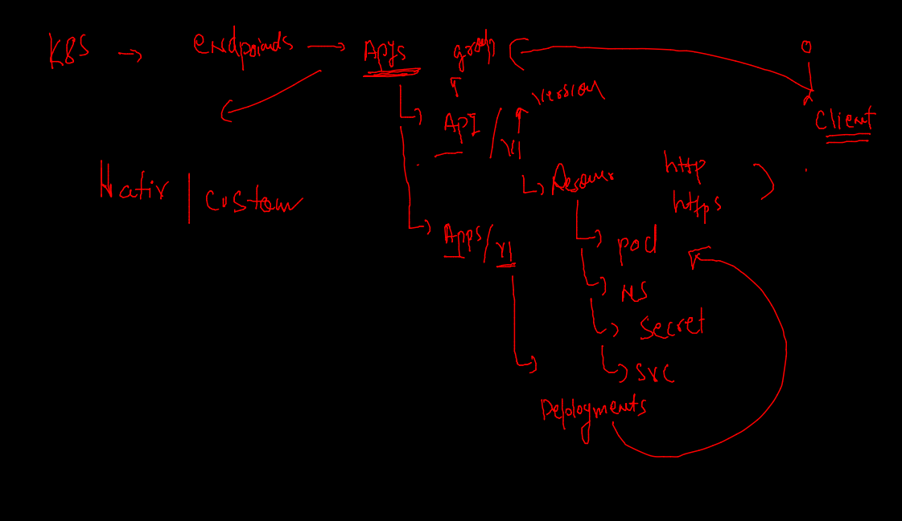

# k8s Master node component

## controllers 


### api resources understanding 



### COnfigMAP 


### env 

```
% kubectl create configmap  ashuenv  --from-literal   key1=app1                  configmap/ashuenv created
fire@ashutoshhs-MacBook-Air ~ % kubectl get  cm 
NAME               DATA   AGE
ashuenv            1      43s
kube-root-ca.crt   1      21h

```

### deploy app 

```
kubectl apply -f  envdeploy.yaml 
deployment.apps/ashuapp created
[ashu@ip-172-31-95-240 k8sapps]$ kubectl get deploy 
NAME      READY   UP-TO-DATE   AVAILABLE   AGE
ashuapp   1/1     1            1           7s
[ashu@ip-172-31-95-240 k8sapps]$ kubectl get cm
NAME               DATA   AGE
ashuenv            1      4m7s
kube-root-ca.crt   1      21h
[ashu@ip-172-31-95-240 k8sapps]$ kubectl get  po
NAME                       READY   STATUS    RESTARTS   AGE
ashuapp-6758d9d668-j9pxb   1/1     Running   0          18s

```

### varify env 

```
kubectl exec -it  ashuapp-6758d9d668-j9pxb  -- env  
PATH=/usr/local/sbin:/usr/local/bin:/usr/sbin:/usr/bin:/sbin:/bin
HOSTNAME=ashuapp-6758d9d668-j9pxb
TERM=xterm
deploy=app1

```

### creating nodeport service using expose 

```
kubectl  get deploy 
NAME      READY   UP-TO-DATE   AVAILABLE   AGE
ashuapp   1/1     1            1           6m9s
fire@ashutoshhs-MacBook-Air ~ % kubectl expose deploy  ashuapp  --type NodePort --port 1122 --target-port 80      --name ashusvc111 
service/ashusvc111 exposed
fire@ashutoshhs-MacBook-Air ~ % kubectl  get  svc 
NAME         TYPE       CLUSTER-IP     EXTERNAL-IP   PORT(S)          AGE
ashusvc111   NodePort   10.98.22.205   <none>        1122:30497/TCP   6s

```

### NP and LB svc 

```
 kubectl expose deploy ashuapp  --type LoadBalancer  --port 1234 --target-port 80  --name lbsvc 
service/lbsvc exposed
fire@ashutoshhs-MacBook-Air ~ % kubectl get  svc
NAME         TYPE           CLUSTER-IP      EXTERNAL-IP   PORT(S)          AGE
ashusvc111   NodePort       10.98.22.205    <none>        1122:30497/TCP   20m
lbsvc        LoadBalancer   10.103.200.48   <pending>     1234:31090/TCP   3s
```

