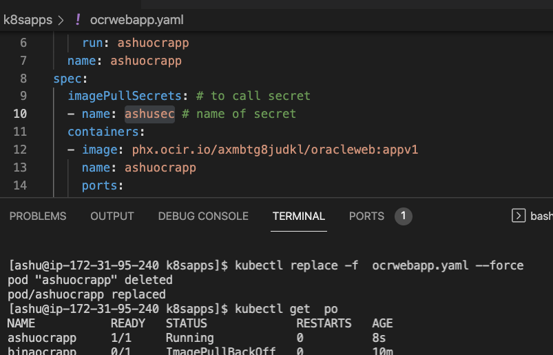

# k8s revision --


### api resources listing through curl 


## auto generate YAML / JSON 

```
kubectl  run  ashuwebapp --image=docker.io/dockerashu/oracleweb:appv1  --port=80  --dry-run=client  -o yaml 
kubectl  run  ashuwebapp --image=docker.io/dockerashu/oracleweb:appv1  --port=80  --dry-run=client  -o json 
```

### Deploy pod yaml 

```
 kubectl apply -f web.yaml 
pod/ashuwebapp created
[ashu@ip-172-31-95-240 k8sapps]$ kubectl get  po
NAME          READY   STATUS    RESTARTS   AGE
ashuwebapp    1/1     Running   0          5s
mohitwebapp   1/1     Running   0          39s
[ashu@ip-172-31-95-240 k8sapps]$ kubectl get  po -o wide
NAME          READY   STATUS    RESTARTS   AGE   IP               NODE                            NOMINATED NODE   READINESS GATES
ashuwebapp    1/1     Running   0          16s   192.168.60.194   ip-172-31-89-245.ec2.internal   <none>           <none>
mohitwebapp   1/1     Running   0          50s   192.168.60.193   ip-172-31-89-245.ec2.internal   <none>           <none>
  

```

### additional info about pod 

```
 kubectl  describe  pod  ashuwebapp 
Name:         ashuwebapp
Namespace:    default
Priority:     0
Node:         ip-172-31-89-245.ec2.internal/172.31.89.245
Start Time:   Wed, 23 Feb 2022 04:58:45 +0000
Labels:       run=ashuwebapp
Annotations:  cni.projectcalico.org/containerID: 22d0f49ad7b61fba8b1a17e076bad1f60bf474e2451cee138cd26c96dfd4f8a2
              cni.projectcalico.org/podIP: 192.168.60.194/32
              cni.projectcalico.org/podIPs: 192.168.60.194/32
Status:       Running
IP:           192.168.60.194
IPs:
  IP:  192.168.60.194
```

## Container networking 


### CNI bridge


###  Intro to Internal LB 


### Service intro 


## Nodeport service 


### checking labels of the pods

```
kubectl apply -f  web.yaml 
pod/ashuwebapp configured
[ashu@ip-172-31-95-240 k8sapps]$ kubectl get  po    --show-labels
NAME           READY   STATUS    RESTARTS   AGE   LABELS
ashuwebapp     1/1     Running   0          75m   x=helloashuapp
binawebapp     1/1     Running   0          74m   run=binawebapp

```

### creating service of nodeport type 

```
 kubectl create  service 
Create a service using a specified subcommand.

Aliases:
service, svc

Available Commands:
  clusterip    Create a ClusterIP service
  externalname Create an ExternalName service
  loadbalancer Create a LoadBalancer service
  nodeport     Create a NodePort service

```

### 

```
 kubectl create  service nodeport  ashusvc1  --tcp 1234:80  --dry-run=client  -o yaml 
apiVersion: v1
kind: Service
metadata:
  creationTimestamp: null
  labels:
    app: ashusvc1
  name: ashusvc1
spec:
  ports:
  - name: 1234-80
    port: 1234
    protocol: TCP
    targetPort: 80
  selector:
    app: ashusvc1
  type: NodePort
status:
  loadBalancer: {}


```

### deploy svc 

```
 ls
pod1.yaml  websvc.yaml  web.yaml
[ashu@ip-172-31-95-240 k8sapps]$ kubectl apply -f  websvc.yaml 
service/ashusvc1 created
[ashu@ip-172-31-95-240 k8sapps]$ kubectl get service 
NAME         TYPE        CLUSTER-IP       EXTERNAL-IP   PORT(S)          AGE
ashusvc1     NodePort    10.109.135.160   <none>        1234:31058/TCP   7s
kubernetes   ClusterIP   10.96.0.1        <none>        443/TCP          20h
[ashu@ip-172-31-95-240 k8sapps]$ kubectl get svc
NAME         TYPE        CLUSTER-IP       EXTERNAL-IP   PORT(S)          AGE
ashusvc1     NodePort    10.109.135.160   <none>        1234:31058/TCP   18s
deeptisvc1   NodePort    10.106.17.178    <none>        1234:31712/TCP   10s
kubernetes   ClusterIP   10.96.0.1        <none>        443/TCP          20h

```

### svc deployed

```
 kubectl  describe  svc  ashusvc1 
Name:                     ashusvc1
Namespace:                default
Labels:                   app=ashusvc1
Annotations:              <none>
Selector:                 x=helloashuapp
Type:                     NodePort
IP Family Policy:         SingleStack
IP Families:              IPv4
IP:                       10.109.135.160
IPs:                      10.109.135.160
Port:                     1234-80  1234/TCP
TargetPort:               80/TCP
NodePort:                 1234-80  31058/TCP
Endpoints:                192.168.60.194:80
Session Affinity:         None
External Traffic Policy:  Cluster
Events:                   <none>

```

### running pod yaml -- backup and restore 

```
 kubectl get po  binawebapp -o yaml  >/tmp/myyam.yaml
fire@ashutoshhs-MacBook-Air ~ % vim /tmp/myyam.yaml 
fire@ashutoshhs-MacBook-Air ~ % kubectl apply -f  /tmp/myyam.yaml 
pod/ashuapp created
fire@ashutoshhs-MacBook-Air ~ % kubectl get po 
NAME            READY   STATUS             RESTARTS   AGE
ashuapp         1/1     Running            0          6s
binawebapp      1/1     Running            0          16m
deeptiwebapp    0/1     ImagePullBackOff   0          12m
deeptiwebapp1   0/1     ImagePullBackOff   0          11m
deeptiwebapp2   1/1     Running            0          2m13s
manishwebapp    1/1     Running            0          13m
mohitwebapp     1/1     Running            0          4m19s
fire@ashutoshhs-MacBook-Air ~ % kubectl get po --show-labels
NAME            READY   STATUS             RESTARTS   AGE     LABELS
ashuapp         1/1     Running            0          14s     OCR=binawebapp
binawebapp      1/1     Running            0          16m     OCR=binawebapp

```

### deploy private image in K8s --

### POD yaml --

### Intro to secret resource 


### creating secret yaml 

```
 kubectl  create  secret  
Create a secret using specified subcommand.

Available Commands:
  docker-registry Create a secret for use with a Docker registry
  generic         Create a secret from a local file, directory, or literal value
  tls             Create a TLS secret


```

### 

```
kubectl  create  secret  docker-registry  ashusec  --docker-server  phx.ocir.io            --docker-username="axmbtg8judkl/learntechbyme@gmail.com"  --docker-password="N0.rs]98{3OXTuLQ0uDQ"  --dry-run=client       -o yaml  >ocrsec.yaml 
[ashu@ip-172-31-95-240 k8sapps]$ kubectl  apply -f ocrsec.yaml 
secret/ashusec created
[ashu@ip-172-31-95-240 k8sapps]$ kubectl get  secret 
NAME                  TYPE                                  DATA   AGE
ashusec               kubernetes.io/dockerconfigjson        1      6s
default-token-4phqc   kubernetes.io/service-account-token   3      21h

```

### using secret 



### creating service using expose 

```
 kubectl get po --show-labels 
NAME           READY   STATUS    RESTARTS   AGE     LABELS
ashuocrapp     1/1     Running   0          4m55s   run=ashuocrapp
binaocrapp     1/1     Running   0          116s    run=ashuocrapp
deeptiocrapp   1/1     Running   0          15m     run=deeptiocrapp
dineshocrapp   1/1     Running   0          2m26s   run=dineshocrapp
dineshwebapp   1/1     Running   0          16m     ocr=dineshassgnsvc1
manishocrapp   1/1     Running   0          4m31s   run=manishocrapp
mohitocrapp    1/1     Running   0          15m     run=mohitocrapp
fire@ashutoshhs-MacBook-Air ~ % kubectl expose  pod   ashuocrapp  --type NodePort --port 1234 --target-port 80 --name ashusvc1  
service/ashusvc1 exposed
fire@ashutoshhs-MacBook-Air ~ % kubectl get  svc
NAME         TYPE        CLUSTER-IP      EXTERNAL-IP   PORT(S)          AGE
ashusvc1     NodePort    10.103.189.68   <none>        1234:30902/TCP   4s
kubernetes   ClusterIP   10.96.0.1       <none>        443/TCP          22m
fire@ashutoshhs-MacBook-Air ~ % kubectl get  svc -o wide
NAME         TYPE        CLUSTER-IP      EXTERNAL-IP   PORT(S)          AGE   SELECTOR
ashusvc1     NodePort    10.103.189.68   <none>        1234:30902/TCP   10s   run=ashuocrapp

```

### k8s namespaces concept 


### creating namespace 

```
kubectl create  namespace  ashu-project                           
namespace/ashu-project created
fire@ashutoshhs-MacBook-Air ~ % kubectl get  namespaces
NAME              STATUS   AGE
ashu-project      Active   10s
default           Active   22h
kube-node-lease   Active   22h
kube-public       Active   22h
kube-system       Active   22h

```

### changing default namespace 

```
$ kubectl get  po
No resources found in default namespace.
[ashu@ip-172-31-95-240 k8sapps]$ 
[ashu@ip-172-31-95-240 k8sapps]$ 
[ashu@ip-172-31-95-240 k8sapps]$ kubectl config set-context  --current --namespace=ashu-project
Context "kubernetes-admin@kubernetes" modified.
[ashu@ip-172-31-95-240 k8sapps]$ 
[ashu@ip-172-31-95-240 k8sapps]$ kubectl get  pods
No resources found in ashu-project namespace.

```

##

```
kubectl  config get-contexts 
CURRENT   NAME                          CLUSTER      AUTHINFO           NAMESPACE
*         kubernetes-admin@kubernetes   kubernetes   kubernetes-admin   ashu-project
[ashu@ip-172-31-95-240 k8sapps]$ 

```

### deploy yamls in custom namespace 

```
 ls
ocrsec.yaml  ocrwebapp.yaml  pod1.yaml  websvc.yaml  web.yaml
[ashu@ip-172-31-95-240 k8sapps]$ kubectl  config get-contexts 
CURRENT   NAME                          CLUSTER      AUTHINFO           NAMESPACE
*         kubernetes-admin@kubernetes   kubernetes   kubernetes-admin   ashu-project
[ashu@ip-172-31-95-240 k8sapps]$ kubectl apply -f . 
secret/ashusec created
pod/ashuocrapp created
pod/ashupod-1 created
pod/ashuwebapp created
service/ashusvc1 created
[ashu@ip-172-31-95-240 k8sapps]$ kubectl get  po,svc
NAME             READY   STATUS    RESTARTS   AGE
pod/ashuocrapp   1/1     Running   0          18s
pod/ashupod-1    1/1     Running   0          18s
pod/ashuwebapp   1/1     Running   0          18s

NAME               TYPE       CLUSTER-IP      EXTERNAL-IP   PORT(S)          AGE
service/ashusvc1   NodePort   10.105.46.134   <none>        1234:30195/TCP   18s
```

### checking pods 

```
kubectl get  po  -n  bina-project
NAME         READY   STATUS    RESTARTS   AGE
binamypod1   1/1     Running   0          2m4s
binaocrapp   1/1     Running   0          2m4s
binapod-1    1/1     Running   0          2m4s
binawebapp   1/1     Running   0          2m4s

```

### Delete all resources under current namespace 

```
kubectl config get-contexts
CURRENT   NAME                          CLUSTER      AUTHINFO           NAMESPACE
*         kubernetes-admin@kubernetes   kubernetes   kubernetes-admin   ashu-project
[ashu@ip-172-31-95-240 k8sapps]$ kubectl  get  all
NAME             READY   STATUS    RESTARTS   AGE
pod/ashuocrapp   1/1     Running   0          73m
pod/ashupod-1    1/1     Running   0          73m
pod/ashuwebapp   1/1     Running   0          73m

NAME               TYPE       CLUSTER-IP      EXTERNAL-IP   PORT(S)          AGE
service/ashusvc1   NodePort   10.105.46.134   <none>        1234:30195/TCP   73m
[ashu@ip-172-31-95-240 k8sapps]$ kubectl delete all --all
pod "ashuocrapp" deleted
pod "ashupod-1" deleted
pod "ashuwebapp" deleted
service "ashusvc1" deleted

```

### kube-system -- namespace

```
 kubectl get po -n kube-system
NAME                                       READY   STATUS    RESTARTS        AGE
calico-kube-controllers-566dc76669-84mjr   1/1     Running   1 (5h52m ago)   23h
calico-node-q5t7c                          1/1     Running   1 (5h52m ago)   23h
calico-node-tss78                          1/1     Running   0               5h53m
calico-node-vqnbm                          1/1     Running   1 (5h52m ago)   23h
coredns-64897985d-9mxc8                    1/1     Running   1 (5h52m ago)   23h
coredns-64897985d-wtkkk                    1/1     Running   1 (5h52m ago)   23h
etcd-control-plane                         1/1     Running   1 (5h52m ago)   23h

```

### Intro to deployment 


### create deployment and scaling 

```
kubectl create  deployment  ashudep1  --image=docker.io/dockerashu/oracleweb:appv2  --port 80  --dry-run=client -o yaml >deploy.yaml
```

### deploy pod yaml --

```
kubectl apply -f  deploy.yaml 
deployment.apps/ashudep1 created
[ashu@ip-172-31-95-240 k8sapps]$ kubectl get deployments
NAME       READY   UP-TO-DATE   AVAILABLE   AGE
ashudep1   1/1     1            1           6s
[ashu@ip-172-31-95-240 k8sapps]$ kubectl get deploy
NAME       READY   UP-TO-DATE   AVAILABLE   AGE
ashudep1   1/1     1            1           10s

```

### self healing 

```
$ kubectl apply -f  deploy.yaml 
deployment.apps/ashudep1 created
[ashu@ip-172-31-95-240 k8sapps]$ kubectl get deployments
NAME       READY   UP-TO-DATE   AVAILABLE   AGE
ashudep1   1/1     1            1           6s
[ashu@ip-172-31-95-240 k8sapps]$ kubectl get deploy
NAME       READY   UP-TO-DATE   AVAILABLE   AGE
ashudep1   1/1     1            1           10s
[ashu@ip-172-31-95-240 k8sapps]$ kubectl get  po
NAME                        READY   STATUS    RESTARTS   AGE
ashudep1-68d478fd66-jswnb   1/1     Running   0          3m1s
[ashu@ip-172-31-95-240 k8sapps]$ kubectl delete po  ashudep1-68d478fd66-jswnb
pod "ashudep1-68d478fd66-jswnb" deleted
[ashu@ip-172-31-95-240 k8sapps]$ kubectl get  po
NAME                        READY   STATUS    RESTARTS   AGE
ashudep1-68d478fd66-vcck9   1/1     Running   0          10s
[ashu@ip-172-31-95-240 k8sapps]$ 
```

### manual scaling --

```
kubectl scale  deploy   ashudep1  --replicas=5 
deployment.apps/ashudep1 scaled
[ashu@ip-172-31-95-240 k8sapps]$ kubectl  get deploy 
NAME       READY   UP-TO-DATE   AVAILABLE   AGE
ashudep1   3/5     5            3           11m
[ashu@ip-172-31-95-240 k8sapps]$ kubectl  get deploy 
NAME       READY   UP-TO-DATE   AVAILABLE   AGE
ashudep1   5/5     5            5           11m
[ashu@ip-172-31-95-240 k8sapps]$ kubectl  get  po --show-labels 
NAME                        READY   STATUS    RESTARTS   AGE     LABELS
ashudep1-68d478fd66-5h78h   1/1     Running   0          19s     app=ashudep1,pod-template-hash=68d478fd66
ashudep1-68d478fd66-cl6j8   1/1     Running   0          19s     app=ashudep1,pod-template-hash=68d478fd66
ashudep1-68d478fd66-m4gzk   1/1     Running   0          19s     app=ashudep1,pod-template-hash=68d478fd66
ashudep1-68d478fd66-nj2zk   1/1     Running   0          91s     app=ashudep1,pod-template-hash=68d478fd66
ashudep1-68d478fd66-vcck9   1/1     Running   0          7m20s   app=ashudep1,pod-template-hash=68d478fd66
```

### expose deployment to create svc 

```
kubectl  get  deploy 
NAME       READY   UP-TO-DATE   AVAILABLE   AGE
ashudep1   5/5     5            5           12m
[ashu@ip-172-31-95-240 k8sapps]$ 
[ashu@ip-172-31-95-240 k8sapps]$ kubectl expose deployment  ashudep1  --type NodePort --port 1234 --target-port 80  --name ashusvc2 
service/ashusvc2 exposed
[ashu@ip-172-31-95-240 k8sapps]$ 
[ashu@ip-172-31-95-240 k8sapps]$ 
[ashu@ip-172-31-95-240 k8sapps]$ kubectl get svc
NAME       TYPE       CLUSTER-IP     EXTERNAL-IP   PORT(S)          AGE
ashusvc2   NodePort   10.102.32.53   <none>        1234:32303/TCP   5s

```

### app upgradation 


### update app 

```
 1089  kubectl  set  image deployment  ashudep1  oracleweb=docker.io/dockerashu/oracleweb:appv3
 1090  kubectl describe deploy ashudep1 
 1091  kubectl  get  po
fire@ashutoshhs-MacBook-Air ~ % 
fire@ashutoshhs-MacBook-Air ~ % 
fire@ashutoshhs-MacBook-Air ~ % kubectl  rollout history deploy ashudep1
deployment.apps/ashudep1 
REVISION  CHANGE-CAUSE
1         <none>
2         <none>


```

### rollback to 

```
 kubectl  rollout undo  deploy ashudep1
deployment.apps/ashudep1 rolled back
fire@ashutoshhs-MacBook-Air ~ % kubectl  rollout status deploy ashudep1
deployment "ashudep1" successfully rolled out
```


